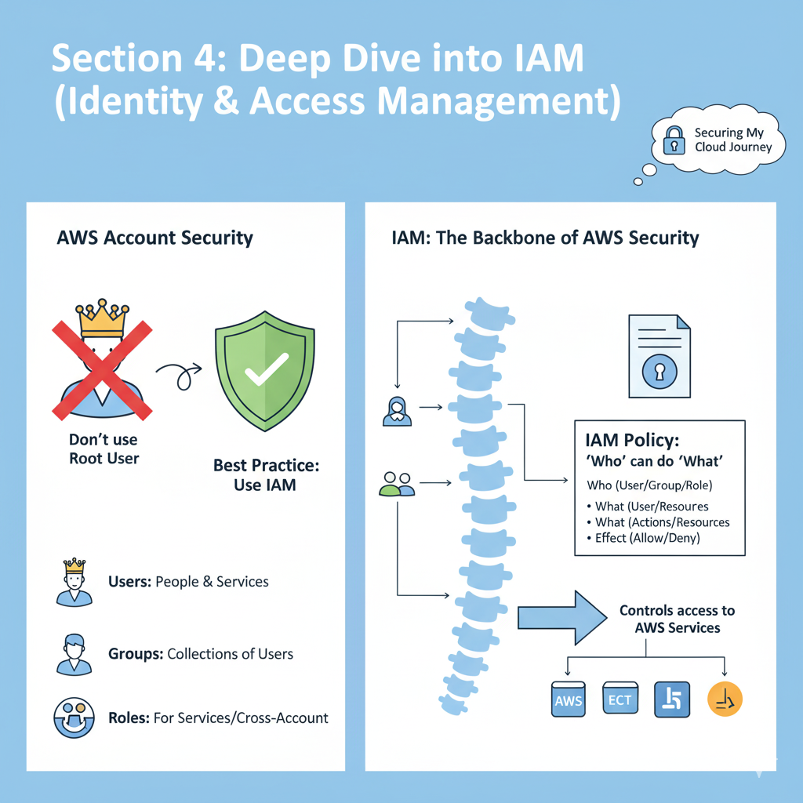

# Section 4: Deep Dive into IAM (Identity & Access Management)

This section marks a critical step in my AWS journey: securing my account. I learned that using the root user for everyday tasks is a huge security risk. The correct way is to use AWS Identity and Access Management (IAM) to create and manage users and their permissions. IAM is the backbone of AWS security, controlling "who" can do "what."

## Table of Contents
- [1. What is IAM? The Core Concepts](#1-what-is-iam-the-core-concepts)
- [2. Hands-On: Creating My First IAM User and Admin Group](#2-hands-on-creating-my-first-iam-user-and-admin-group)
- [3. Understanding IAM Policies: The Rules of AWS](#3-understanding-iam-policies-the-rules-of-aws)
- [4. Hands-On: Experimenting with IAM Policies](#4-hands-on-experimenting-with-iam-policies)
- [5. Securing My Account: Password Policies and MFA](#5-securiting-my-account-password-policies-and-mfa)
- [6. Hands-On: Setting Up a Password Policy and MFA](#6-hands-on-setting-up-a-password-policy-and-mfa)
- [7. Accessing AWS Programmatically: CLI, SDK, and Access Keys](#7-accessing-aws-programmatically-cli-sdk-and-access-keys)
- [8. Hands-On: Setting Up and Using the AWS CLI](#8-hands-on-setting-up-and-using-the-aws-cli)
- [9. IAM Roles: Granting Permissions to AWS Services](#9-iam-roles-granting-permissions-to-aws-services)
- [10. Auditing My Security: IAM Credentials Report & Access Advisor](#10-auditing-my-security-iam-credentials-report--access-advisor)
- [11. IAM Shared Responsibility Model & Best Practices](#11-iam-shared-responsibility-model--best-practices)
- [12. Section 4: Practice MCQs](#12-section-4-practice-mcqs)

---

### 1. What is IAM? The Core Concepts

IAM is a **global service**; it's not tied to a specific region. When I create a user, that user exists worldwide. Its main components are:

-   **Root Account:** The email address I used to create my AWS account. It has complete, unrestricted access. The best practice is to lock this account away and **never** use it for daily tasks. Its only purpose should be for initial account setup and specific account-level tasks.
-   **Users:** A user represents a single person (or application) within my organization. Each physical person should have their own unique IAM user.
-   **Groups:** A group is a collection of users. Instead of applying permissions one-by-one to each user, I can put them in a group and apply permissions to the group. All users in the group inherit those permissions.
    -   *Key Rules:* Groups can only contain users, not other groups. A user can belong to multiple groups.
-   **Policies:** A policy is a JSON document that explicitly defines permissions. It states what actions are allowed or denied on which AWS resources. This is where the **Principle of Least Privilege** comes in: only grant the minimum permissions a user needs to perform their job.

---

### 2. Hands-On: Creating My First IAM User and Admin Group

My first task was to stop using the root user. I followed these steps to create a new administrative user for myself:

1.  **Navigate to IAM:** I used the search bar in the AWS Console to go to the IAM service. I noticed the region selector was grayed out and said "Global," confirming it's not a regional service.
2.  **Create a User:**
    -   I went to the "Users" tab and clicked "Create user."
    -   I gave it a username: `Stephane`.
    -   I checked the box to provide myself access to the **AWS Management Console**.
    -   I chose to create an IAM user and set a **custom password**, unchecking the option that requires a password reset on the first login (since this user is for me).
3.  **Create a Group and Add User:**
    -   In the permissions step, instead of attaching a policy directly, I chose to create a new group.
    -   I named the group `admin`.
    -   I attached the AWS-managed policy named **`AdministratorAccess`**. This policy grants full access to all AWS services and resources.
    -   I added my new `Stephane` user to this `admin` group.
4.  **Review and Create:** I reviewed the details and created the user. Now, my `Stephane` user has full admin rights because it is a member of the `admin` group.
5.  **Log in as the IAM User:**
    -   From the IAM dashboard, I found my account's unique **Sign-in URL**. I can customize this with an "account alias" to make it more memorable.
    -   I opened a **private/incognito browser window**. This is a great trick to stay logged into the root account in one window while logging into an IAM user in another.
    -   I navigated to the sign-in URL, chose "IAM user," and entered my account ID (or alias), username (`Stephane`), and the password I set.
    -   Success! I was now logged into the console as my IAM user, not the root user. The top-right corner now shows `Stephane @ <account-id>`.

---

### 3. Understanding IAM Policies: The Rules of AWS

A policy is the most granular piece of IAM. It's a JSON document with a few key components:

-   **Version:** The policy language version, usually `"2012-10-17"`.
-   **Statement:** The main part of the policy, which can contain one or more individual statements. Each statement includes:
    -   **Effect:** What the statement does. This will be either `Allow` or `Deny`.
    -   **Action:** The list of specific API calls that are allowed or denied (e.g., `ec2:DescribeInstances`, `s3:ListAllMyBuckets`). `*` can be used as a wildcard.
    -   **Resource:** The Amazon Resource Name (ARN) of the resource(s) the action applies to (e.g., a specific S3 bucket, a specific EC2 instance). `*` means it applies to all resources.
    -   **Principal:** (Used in resource-based policies) Defines who is allowed to access the resource.
    -   **Condition:** (Optional) Conditions for when the policy is in effect (e.g., only allow access if the request comes from a specific IP address).

---

### 4. Hands-On: Experimenting with IAM Policies

To truly understand how policies work, I performed a few experiments:

1.  **Breaking Permissions:** While logged in as my root user, I went to the `admin` group and *removed* my `Stephane` user. In my other browser window (logged in as `Stephane`), I refreshed the IAM users page. I immediately got an **Access Denied** error. This proves that permissions are inherited from the group and are enforced in real-time.
2.  **Attaching a Policy Directly:** I went back to the `Stephane` user (using my root account) and attached a policy directly to the user. I searched for and added the **`IAMReadOnlyAccess`** policy.
3.  **Testing Read-Only Access:** Back in the `Stephane` window, I refreshed. I could now see the list of users again! However, when I tried to *create* a new group, I got an Access Denied error. This is the principle of least privilege in action: the policy gave me permission to *read* IAM information, but not to *write* or change it.
4.  **Viewing a Policy's JSON:** I looked at the JSON for the `AdministratorAccess` policy. It was simple: `Effect: "Allow", Action: "*", Resource: "*"`. This translates to: "Allow any action on any resource," which is why it grants full admin rights.
5.  **Creating a Custom Policy:** I used the visual policy editor to create a new, very specific policy. I chose the IAM service and only allowed the `ListUsers` and `GetUser` actions. The editor generated the correct JSON for me, which I could then save and attach to a user or group.

Finally, I cleaned up by deleting the extra group I created, removing the directly attached policy, and adding my `Stephane` user back to the `admin` group.

---

### 5. Securing My Account: Password Policies and MFA

IAM provides two crucial tools for strengthening user security:

-   **Password Policy:** I can set account-wide rules for user passwords to ensure they are strong. This includes setting a minimum length, requiring specific character types (uppercase, lowercase, numbers, symbols), forcing password rotation after a certain number of days, and preventing password reuse.
-   **Multi-Factor Authentication (MFA):** This is the single most effective way to protect an account. It adds a second layer of security by requiring something you know (your password) AND something you have (a physical or virtual device). Even if a hacker steals my password, they can't log in without my MFA device.
    -   **MFA Device Options:**
        -   **Virtual MFA Device (Most Common):** An app on your smartphone like Google Authenticator or Authy.
        -   **U2F Security Key:** A physical USB device like a YubiKey.
        -   **Hardware Key Fob:** A small hardware device that generates codes.

---

### 6. Hands-On: Setting Up a Password Policy and MFA

I immediately applied these security measures to my account:

1.  **Set Password Policy:** In the IAM console, under "Account settings," I edited the password policy. I set a minimum length and required multiple character types.
2.  **Enable MFA on Root Account:** This is **critically important**.
    -   While logged in as the **root user**, I clicked my account name in the top right and went to "Security credentials."
    -   I found the Multi-factor authentication (MFA) section and clicked "Assign MFA device."
    -   I chose "Authenticator app" as the type.
    -   AWS displayed a QR code on the screen.
    -   On my phone, I opened my authenticator app (like Google Authenticator), added a new account, and scanned the QR code.
    -   The app immediately started generating 6-digit codes that change every 30 seconds.
    -   To finish, I had to enter two consecutive codes from my app into the AWS console to prove it was synced correctly.
    -   MFA was now active on my root account. When I logged out and back in, AWS prompted me for a code from my phone after I entered my password.

---

### 7. Accessing AWS Programmatically: CLI, SDK, and Access Keys

The Management Console is great for interactive work, but for automation and scripting, I need programmatic access. There are three ways to do this:

-   **AWS Command Line Interface (CLI):** A tool I install on my computer that lets me interact with AWS services by typing commands in my terminal.
-   **AWS Software Development Kit (SDK):** Language-specific libraries (e.g., for Python, JavaScript, Java) that let me call AWS services from within my application code.
-   **Access Keys:** To use the CLI or SDK, I need credentials. These are not a password. An access key consists of two parts: an **Access Key ID** (like a username) and a **Secret Access Key** (like a password). **These are highly sensitive and must be kept secret and never shared.**

---

### 8. Hands-On: Setting Up and Using the AWS CLI

1.  **Install the AWS CLI:** I followed the official AWS documentation to download and run the installer for my operating system. After it was done, I opened my terminal and typed `aws --version` to confirm it was installed correctly.
2.  **Create an Access Key:**
    -   I went to my `Stephane` IAM user's security credentials tab.
    -   I clicked "Create access key" and selected "Command Line Interface (CLI)" as the use case.
    -   AWS then displayed the **Access Key ID** and **Secret Access Key**. **This is the ONLY time the secret key is shown.** I copied them to a secure location immediately.
3.  **Configure the CLI:** In my terminal, I ran the command `aws configure`.
    -   It prompted me for my Access Key ID. I pasted it in.
    -   It prompted me for my Secret Access Key. I pasted it in.
    -   It asked for a Default region name. I entered `eu-west-1`.
    -   It asked for a Default output format. I left it as the default (JSON).
4.  **Test the CLI:** I ran the command `aws iam list-users`. The terminal returned a JSON object listing my `Stephane` user, proving that my CLI was successfully configured and authenticated to my AWS account.

I also learned about **AWS CloudShell**, a browser-based terminal available directly in the AWS Console. It comes pre-authenticated with the credentials of the user I'm logged in as, making it a quick alternative to setting up the CLI locally.

---

### 9. IAM Roles: Granting Permissions to AWS Services

What if an AWS service needs to perform actions on another service? For example, what if my EC2 virtual server needs to read files from an S3 bucket? I shouldn't save an access key on the server; that's insecure.

Instead, I use an **IAM Role**. A role is like a user, but it's intended to be assumed by an AWS service, not a person. I create a role, attach policies to it (just like a user), and then I can assign that role to an AWS service (like an EC2 instance). The service then temporarily inherits the permissions of that role to make secure API calls on my behalf.

I practiced this by creating a role named `DemoRoleForEC2`. I specified that the "trusted entity" was the EC2 service and attached the `IAMReadOnlyAccess` policy to it. I'll use this role later in the course when I launch my first EC2 instance.

---

### 10. Auditing My Security: IAM Credentials Report & Access Advisor

IAM provides two powerful tools for auditing and improving security:

-   **IAM Credentials Report:** An account-level CSV report that lists all the users in my account and the status of their credentials. I can see if their password is enabled, when it was last changed, if MFA is active, and if they have active access keys. This is great for a high-level security audit.
-   **IAM Access Advisor:** A user-level feature. It shows me a list of all the services a user has permission to access and, more importantly, **when they last accessed them**. This is extremely useful for applying the principle of least privilege. If I see a user has permissions for a service they haven't used in 6 months, I can probably remove that permission to tighten their security posture.

---

### 11. IAM Shared Responsibility Model & Best Practices

For IAM, the responsibility is divided clearly:

-   **AWS's Responsibility (Security OF the cloud):** Managing the underlying infrastructure, ensuring the IAM service is secure and available.
-   **My Responsibility (Security IN the cloud):**
    -   Creating and managing users, groups, roles, and policies.
    -   Enabling MFA for all users.
    -   Rotating access keys and passwords.
    -   Using IAM tools like the Access Advisor to apply the principle of least privilege.
    -   **NEVER sharing credentials.**

**Summary of Best Practices:**
-   Don't use the root account.
-   One physical user = One IAM user.
-   Use groups to manage permissions.
-   Enforce a strong password policy.
-   Enforce MFA for all users.
-   Use roles for AWS services.
-   Never share access keys.
-   Audit permissions regularly with IAM tools.

---

### 12. Section 4: Practice MCQs

**Question 1:**
A new developer joins your team. They need to be able to deploy applications using AWS Elastic Beanstalk but should have no permissions to create or modify IAM users. What is the most secure and efficient way to grant them the necessary access?

- a) Create a new IAM user for them and attach the `AdministratorAccess` policy.

- b) Give them the Access Key and Secret Key of an existing developer's IAM user.

- c) Create a new IAM user and put them in a "Developers" group that has the `AWSElasticBeanstalkFullAccess` policy attached.

- d) Tell them to use the root account credentials for their first week.

**Question 2:**
An EC2 instance in your account needs to read data from an S3 bucket. What is the most secure method to grant the necessary permissions to the EC2 instance?

- a) Create an IAM user with S3 read permissions and store its access keys in a file on the EC2 instance.

- b) Create an IAM role with an S3 read-only policy and attach the role to the EC2 instance.

- c) Attach the `AmazonS3FullAccess` policy to the `admin` group.

- d) Log into the EC2 instance and configure the AWS CLI with your personal IAM user's access keys.

**Question 3:**
You are reviewing your company's security posture and want to ensure that all users have strong passwords. Which IAM feature allows you to enforce rules such as minimum password length and required character types for all IAM users?

- a) IAM Access Advisor

- b) IAM Credentials Report

- c) IAM Password Policy

- d) Multi-Factor Authentication (MFA)

**Question 4:**
According to the AWS Shared Responsibility Model, who is responsible for enabling Multi-Factor Authentication (MFA) on an IAM user account?

- a) AWS is responsible, as it's part of the global infrastructure security.

- b) The customer is responsible for enabling and managing MFA for their users.

- c) Both AWS and the customer share the responsibility equally.

- d) The responsibility depends on the AWS Region the user is in.

**Question 5:**
You want to programmatically interact with AWS services from your local machine's terminal to automate a task. What do you need to create and configure to make this possible?

- a) A new IAM group and an IAM role.

- b) An account alias for the AWS sign-in page.

- c) A password policy and an MFA device.

- d) An IAM user with an Access Key ID and a Secret Access Key configured in the AWS CLI.

---
 

**MCQ Answers:**
1.  **c)** This follows the principle of least privilege (only granting Elastic Beanstalk access) and the best practice of using groups for permissions management. Options A, B, and D are all major security violations.

2.  **b)** Using an IAM Role is the standard, most secure way to grant permissions to AWS services. Storing access keys on an EC2 instance (A and D) is a significant security risk. Option C is incorrect because it grants overly broad permissions to a group of users, not the EC2 instance itself.

3.  **c)** The IAM Password Policy is the specific feature designed to enforce password strength requirements across an entire AWS account. The other tools serve different purposes (auditing and authentication).

4.  **b)** The customer is responsible for security *in* the cloud, which includes all aspects of user and credential management, such as enabling MFA. AWS is responsible for the security *of* the cloud (the underlying infrastructure).

5.  **d)** To use the AWS CLI, you need an IAM user, you must generate an access key pair for that user, and then configure those credentials on your local machine using the `aws configure` command.
  