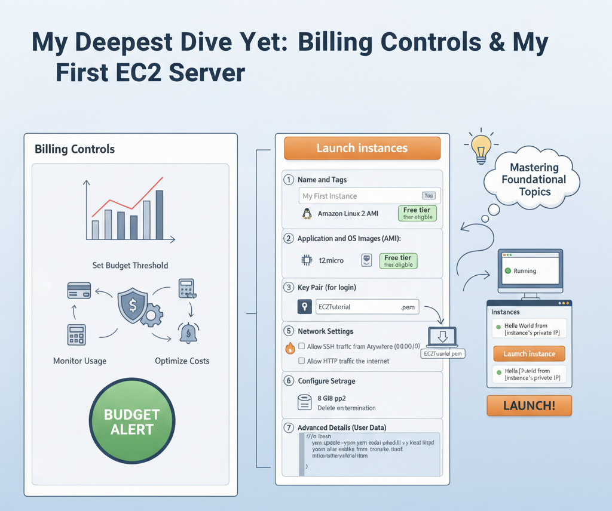

# Section 5: My Deepest Dive Yet - Billing Controls & My First EC2 Server

This section is where things get real. I'm moving from theory and basic setup to managing two of the most critical aspects of AWS: cost control and the fundamental compute service, EC2. I'm documenting every single step and concept in extreme detail to ensure I master these foundational topics.

## Table of Contents

### Part 1: Managing My AWS Costs
- [1. The Problem: IAM Users Can't See Billing Info by Default](#1-the-problem-iam-users-cant-see-billing-info-by-default)
- [2. Practical Steps: How I Activated IAM Access to Billing](#2-practical-steps-how-i-activated-iam-access-to-billing)
- [3. A Tour of the Billing & Cost Management Dashboard](#3-a-tour-of-the-billing--cost-management-dashboard)
- [4. Practical Steps: How I Created Budgets to Prevent Overspending](#4-practical-steps-how-i-created-budgets-to-prevent-overspending)

### Part 2: My First Virtual Server with Amazon EC2
- [5. What is Amazon EC2? The Core of AWS Compute](#5-what-is-amazon-ec2-the-core-of-aws-compute)
- [6. Practical Steps: Launching My First EC2 Instance (A Detailed Walkthrough)](#6-practical-steps-launching-my-first-ec2-instance-a-detailed-walkthrough)
- [7. Understanding EC2 Instance Types](#7-understanding-ec2-instance-types)
- [8. Security Groups: My EC2 Instance's Virtual Firewall](#8-security-groups-my-ec2-instances-virtual-firewall)
- [9. Practical Steps: How I Configured and Tested My Security Group](#9-practical-steps-how-i-configured-and-tested-my-security-group)
- [10. Connecting to My Instance: The World of SSH](#10-connecting-to-my-instance-the-world-of-ssh)
- [11. Practical Steps: Connecting with EC2 Instance Connect (The Easy Way)](#11-practical-steps-connecting-with-ec2-instance-connect-the-easy-way)
- [12. Practical Steps: Connecting with SSH on Mac/Linux/Windows 10](#12-practical-steps-connecting-with-ssh-on-maclinuxwindows-10)
- [13. Practical Steps: Connecting with PuTTY on Windows](#13-practical-steps-connecting-with-putty-on-windows)
- [14. IAM Roles for EC2: The Secure Way to Grant Permissions](#14-iam-roles-for-ec2-the-secure-way-to-grant-permissions)
- [15. Practical Steps: Attaching an IAM Role to My EC2 Instance](#15-practical-steps-attaching-an-iam-role-to-my-ec2-instance)
- [16. EC2 Purchasing Options: Optimizing for Cost and Workload](#16-ec2-purchasing-options-optimizing-for-cost-and-workload)
- [17. EC2 Shared Responsibility Model](#17-ec2-shared-responsibility-model)

---

## Part 1: Managing My AWS Costs

Before I start creating resources that could potentially cost money, it's absolutely essential to set up safeguards. This part is all about gaining visibility into my spending and creating alarms to notify me if costs exceed my expectations.

### 1. The Problem: IAM Users Can't See Billing Info by Default

-   **What is it?** This is a critical security feature in AWS. By default, even an IAM user with `AdministratorAccess` (like the one I created in the last section) cannot view the Billing and Cost Management console.
-   **Why is this the default?** Billing information is considered highly sensitive. AWS locks it down to the **root user** only to prevent regular administrative users from seeing the company's financial data. It's a deliberate separation of technical administration and financial administration.
-   **How does it manifest?** When I logged in with my `Stephane` admin user and navigated to the Billing console, I was met with a wall of "Access Denied" errors. This confirmed that my admin user, despite its broad technical permissions, lacked the specific permission to view billing data.

### 2. Practical Steps: How I Activated IAM Access to Billing

To solve this, I had to perform a one-time action using my **root user**. This is one of the few tasks for which using the root user is necessary and appropriate.

1.  **Log In as Root User:** I logged out of my IAM user and logged back in using the root account credentials (the email and password I used to create the account, plus my MFA code).
2.  **Navigate to Account Settings:** I clicked on my account name in the top-right corner and selected "Account" from the dropdown menu.
3.  **Find the Billing Access Setting:** I scrolled down the account settings page until I found a section titled **"IAM User and Role Access to Billing Information."**
4.  **Activate Access:** I saw that access was "Deactivated." I clicked the "Edit" button, checked the "Activate IAM Access" box, and clicked "Update."
5.  **Verification:** A message confirmed that IAM access to billing was now active. I then logged out of my root user and logged back in with my `Stephane` IAM admin user. When I navigated back to the Billing and Cost Management console, all the "Access Denied" errors were gone, and I could see the dashboard.

### 3. A Tour of the Billing & Cost Management Dashboard

Now with access, I explored the key areas of this console:

-   **Dashboard:** This gives a high-level overview, including month-to-date costs, forecasted costs for the month, and a breakdown of spending by service. For a new account, it's mostly empty.
-   **Bills:** This is where I can see a detailed breakdown of charges for any given month. I can drill down to see exactly which service in which region is costing me money. This is my primary tool for investigating any unexpected charges.
-   **Free Tier:** This dashboard is incredibly useful. It shows all the services that have a free tier, how much of that free tier I've used so far in the month, and a forecast of my usage. If a forecast turns red, it's a warning that I'm projected to exceed the free tier limit and will start incurring charges.

### 4. Practical Steps: How I Created Budgets to Prevent Overspending

This is my safety net. An AWS Budget doesn't stop spending, but it sends me an email alert when my costs (or forecasted costs) cross a threshold I define.

1.  **Navigate to Budgets:** In the left-hand navigation pane of the Billing console, I clicked on "Budgets."
2.  **Create a Zero-Spend Budget:** This is a fantastic practice for a learning account.
    -   I clicked "Create budget."
    -   I chose to "Use a template (simplified)."
    -   I selected the **"Zero spend budget"** template.
    -   I gave it a name, like `My Zero Spend Budget`.
    -   I entered my email address in the "Email recipients" field.
    -   I clicked "Create budget." This budget will now email me the moment my spending goes above $0.01.
3.  **Create a Monthly Cost Budget:** I also set up a more realistic monthly budget.
    -   I clicked "Create budget" again and chose the **"Monthly cost budget"** template.
    -   I set my budget amount to **$10**. This is a reasonable amount that I should never hit if I follow the course correctly.
    -   I entered my email address again.
    -   The template automatically sets up three alerts for this budget:
        -   An alert when my *actual* spending reaches 85% of the budget ($8.50).
        -   An alert when my *actual* spending reaches 100% of the budget ($10.00).
        -   An alert when my *forecasted* spending is predicted to reach 100% of the budget.
    -   I clicked "Create budget."

With these two budgets in place, I can now proceed with the hands-on labs with confidence, knowing I will be alerted long before any significant costs could occur.

---

## Part 2: My First Virtual Server with Amazon EC2

This is the most popular service in AWS. EC2 (Elastic Compute Cloud) is the IaaS (Infrastructure as a Service) offering that lets me rent virtual servers in the cloud.

### 5. What is Amazon EC2? The Core of AWS Compute

-   **What is it?** EC2 allows me to provision virtual machines, called **instances**. It's like having a computer in an AWS data center that I can configure and control completely.
-   **Why is it important?** It's the foundation for running almost any application. I get to choose the operating system (Linux, Windows, macOS), the CPU power, the amount of RAM, the storage, and the networking capabilities.
-   **What is Bootstrapping?** This is a key concept. When I launch an instance for the first time, I can provide a script called **EC2 User Data**. This script runs automatically *only once* when the instance first boots up. It's perfect for automating initial setup tasks like installing software, applying updates, or downloading files.

### 6. Practical Steps: Launching My First EC2 Instance (A Detailed Walkthrough)

This was an incredibly detailed process with many options. Here is a step-by-step recreation of exactly what I did.

1.  **Navigate to the EC2 Console:** I found EC2 in the services menu and made sure I was in my chosen region (`eu-west-1` Ireland).
2.  **Start the Launch Wizard:** I clicked on "Instances" in the left pane, then the big orange "Launch instances" button.
3.  **Step 1: Name and Tags:**
    -   **What:** I gave my instance a name: `My First Instance`. This automatically creates a "Tag" with the key `Name` and the value `My First Instance`. Tags are metadata labels that help me organize my resources.
4.  **Step 2: Application and OS Images (AMI):**
    -   **What:** I needed to choose an Amazon Machine Image (AMI). An AMI is a template that contains the operating system and any pre-installed software.
    -   **Why:** This is the base image for my virtual machine.
    -   **How:** I selected **Amazon Linux 2 AMI**. I specifically chose this because it's provided by AWS, is highly optimized for EC2, and is marked **"Free tier eligible."**
5.  **Step 3: Instance Type:**
    -   **What:** This determines the hardware resources (CPU, Memory) for my instance.
    -   **Why:** I need to match the hardware to my application's needs.
    -   **How:** I selected **t2.micro**. This is a small instance type, but crucially, it is also **"Free tier eligible,"** which is perfect for learning.
6.  **Step 4: Key Pair (for login):**
    -   **What:** A key pair is a set of cryptographic keys used to securely connect to my Linux instance via SSH. It consists of a public key (which AWS stores) and a private key (which I download and keep safe).
    -   **Why:** This is how I prove my identity when I connect. It's much more secure than a password.
    -   **How:** I clicked "Create new key pair."
        -   I named it `EC2Tutorial`.
        -   I left the type as `RSA`.
        -   I chose the **`.pem`** format (for Mac/Linux/Windows 10+). If I were on an older Windows version planning to use PuTTY, I would have chosen `.ppk`.
        -   I clicked "Create key pair," and my browser immediately downloaded the `EC2Tutorial.pem` file. **I know this is the only time I can download this file, so I moved it to a secure, memorable location on my computer.**
7.  **Step 5: Network Settings:**
    -   **What:** This configures networking and the firewall.
    -   **Why:** I need to control who can access my instance from the internet.
    -   **How:** For now, I left the VPC and Subnet as default. The key part was the **Security Group** (the firewall).
        -   The wizard offered to create a new security group for me.
        -   I needed to allow two types of traffic:
            -   I checked the box for **"Allow SSH traffic from"** and left the source as `Anywhere (0.0.0.0/0)`. This opens port 22 so I can connect.
            -   I also checked the box for **"Allow HTTP traffic from the internet."** This opens port 80, which is necessary for my instance to serve web traffic.
8.  **Step 6: Configure Storage:**
    -   **What:** This is the virtual hard drive (an EBS Volume) for my instance.
    -   **Why:** The OS and my files need a place to live.
    -   **How:** I left the default of an 8 GiB `gp2` root volume. This is well within the 30 GiB monthly free tier limit. I noted the "Delete on termination" setting was enabled, which means this virtual drive will be automatically deleted when I terminate the instance.
9.  **Step 7: Advanced Details (User Data):**
    -   **What:** I scrolled all the way to the bottom to find the **User Data** field.
    -   **Why:** This is where I put my bootstrap script to turn my generic Linux server into a web server on its first boot.
    -   **How:** I copied the entire script provided in the course materials and pasted it into the text box. The script performs these actions:
        -   Updates the server's software packages.
        -   Installs the `httpd` (Apache) web server software.
        -   Starts the web server.
        -   Creates a simple `index.html` file with the text "Hello World from [instance's private IP]".
10. **Launch!**
    -   I reviewed the summary on the right and clicked "Launch instance."
    -   After a few moments, the instance state changed from "Pending" to **"Running."**

My virtual server was now live! I selected it in the console and noted its **Public IPv4 address**. I pasted this IP into my browser's address bar (making sure to use `http://` and not `https://`) and saw my "Hello World" message. It worked!

### 7. Understanding EC2 Instance Types

AWS offers a huge variety of instance types, optimized for different tasks. They follow a naming convention: `family.generation.size` (e.g., `m5.2xlarge`).

-   **General Purpose (T, M families):** What I used (`t2.micro`). They provide a good balance of compute, memory, and networking. Perfect for web servers and general development.
-   **Compute Optimized (C family):** Have powerful CPUs relative to their memory. Ideal for tasks that need a lot of processing power, like batch processing, media transcoding, or high-performance computing (HPC).
-   **Memory Optimized (R, X, Z families):** Have a large amount of RAM relative to their CPU. Ideal for in-memory databases, real-time big data processing, and large-scale caching.
-   **Storage Optimized (I, D, H families):** Designed for workloads that require high, sequential read/write access to very large datasets on local storage. Great for data warehousing and distributed file systems.

### 8. Security Groups: My EC2 Instance's Virtual Firewall

-   **What is it?** A Security Group (SG) is a stateful firewall that controls inbound and outbound traffic for my EC2 instances. It acts at the instance level.
-   **How does it work?**
    -   It only contains **Allow rules**. By default, everything is denied. If there isn't a rule explicitly allowing a certain type of traffic, it's blocked.
    -   **Inbound Rules:** Control traffic coming *into* the instance. For my web server, I needed an inbound rule to allow traffic on port 80 (HTTP) from `0.0.0.0/0` (any IP address).
    -   **Outbound Rules:** Control traffic going *out of* the instance. By default, a new SG allows all outbound traffic, letting my instance connect to the internet for updates, etc.
-   **Key Ports to Know (for the exam):**
    -   `22` (SSH): For securely logging into Linux instances.
    -   `80` (HTTP): For unencrypted web traffic.
    -   `443` (HTTPS): For encrypted web traffic.
    -   `3389` (RDP): For connecting to Windows instances (Remote Desktop Protocol).

### 9. Practical Steps: How I Configured and Tested My Security Group

To really see the firewall in action:

1.  **Find the Security Group:** I navigated to the "Security Groups" section in the EC2 console. I found the one created by the launch wizard (`launch-wizard-1`).
2.  **Edit Inbound Rules:** I selected the SG and clicked "Edit inbound rules."
3.  **Delete the HTTP Rule:** I deleted the rule that allowed traffic on port 80 and saved the changes.
4.  **Test the Connection:** I went back to my browser tab with the web server and refreshed the page. The page just spun and spun, eventually timing out. **This "timeout" error is the classic symptom of a blocked Security Group rule.** The traffic never even reached my instance.
5.  **Re-add the Rule:** I went back, edited the inbound rules again, added a new rule of type `HTTP` (which automatically fills in port 80), set the source to `Anywhere-IPv4`, and saved.
6.  **Test Again:** I refreshed my browser, and the "Hello World" page loaded instantly. This proves the SG is the gatekeeper for all traffic.

### 10. Connecting to My Instance: The World of SSH

SSH (Secure Shell) is the protocol used to get a secure command-line terminal on a remote Linux server. I needed this to manage my instance. There are several ways to do it.

### 11. Practical Steps: Connecting with EC2 Instance Connect (The Easy Way)

This is a modern, browser-based method that is often the simplest.

1.  **Select Instance and Connect:** In the EC2 console, I selected my running instance and clicked the "Connect" button at the top.
2.  **Choose EC2 Instance Connect:** I went to the "EC2 Instance Connect" tab. The username (`ec2-user`) was already filled in correctly for Amazon Linux.
3.  **Click Connect:** I just clicked the orange "Connect" button. A new browser tab opened, and within seconds, I had a fully functional terminal session inside my EC2 instance. It was incredibly simple and didn't require me to manage my `.pem` key file at all. Behind the scenes, AWS temporarily pushed a one-time-use public key to the instance for this connection.

### 12. Practical Steps: Connecting with SSH on Mac/Linux/Windows 10

This is the traditional command-line method.

1.  **Open a Terminal:** I opened a terminal application on my local computer.
2.  **Navigate to Key File:** I used the `cd` command to navigate to the directory where I saved my `EC2Tutorial.pem` file.
3.  **Fix Key Permissions (One-Time Step):** SSH is very strict about security. The private key file must not be publicly viewable. I had to run a command to lock it down: `chmod 400 EC2Tutorial.pem`.
4.  **Construct the SSH Command:** The command format is: `ssh -i [private-key-file] [user]@[public-ip]`
    -   My command was: `ssh -i EC2Tutorial.pem ec2-user@54.123.45.67` (using the actual public IP of my instance).
5.  **Connect:** I ran the command. The first time, it asked me to confirm the authenticity of the host; I typed `yes`. I was then logged in and saw the command prompt for my remote instance.

### 13. Practical Steps: Connecting with PuTTY on Windows

For older Windows versions, or for users who prefer a graphical client, PuTTY is the standard.

1.  **Download and Install PuTTY:** This includes two tools: `putty.exe` and `puttygen.exe`.
2.  **Convert the Key (if needed):** PuTTY doesn't use the `.pem` format. It needs its own `.ppk` format.
    -   I opened `puttygen.exe`.
    -   I clicked "Load" and selected my `EC2Tutorial.pem` file.
    -   I then clicked "Save private key" to generate `EC2Tutorial.ppk`.
3.  **Configure PuTTY:**
    -   I opened `putty.exe`.
    -   In the "Host Name" field, I entered `ec2-user@[public-ip]`.
    -   In the left pane, I navigated to `Connection -> SSH -> Auth`.
    -   I clicked "Browse" and selected my newly created `EC2Tutorial.ppk` file.
    -   I went back to the "Session" screen, gave the session a name (e.g., "My First Instance"), and clicked "Save."
4.  **Connect:** I clicked "Open." After accepting the host key, I was logged into my instance.

### 14. IAM Roles for EC2: The Secure Way to Grant Permissions

My EC2 instance might need to interact with other AWS services (e.g., read a file from S3).

-   **The WRONG Way:** Running `aws configure` on the EC2 instance and pasting in my personal IAM user's access keys. This is a massive security risk. If the instance is compromised, my keys are stolen. **I will never do this.**
-   **The RIGHT Way:** Using an **IAM Role**. I create a role, attach the necessary permissions to it, and then associate that role with my EC2 instance. The instance can then automatically and securely obtain temporary credentials to make API calls, without any long-lived keys being stored on the instance itself.

### 15. Practical Steps: Attaching an IAM Role to My EC2 Instance

1.  **Connect to the Instance:** I connected to my instance using one of the SSH methods.
2.  **Test AWS CLI:** The Amazon Linux AMI comes with the AWS CLI pre-installed. I ran `aws iam list-users`. It failed with a "Unable to locate credentials" error. This is expected, as the instance has no permissions yet.
3.  **Attach the Role:** In the EC2 console:
    -   I right-clicked my instance and chose `Security -> Modify IAM role`.
    -   From the dropdown, I selected the `DemoRoleForEC2` role I created in the previous section (which has `IAMReadOnlyAccess` permissions).
    -   I clicked "Save." The role was now attached.
4.  **Test Again:** I went back to my SSH session and ran `aws iam list-users` again. This time, it worked! It returned the list of my IAM users. The EC2 instance securely inherited the permissions from the attached role. This entire process is seamless and secure.

### 16. EC2 Purchasing Options: Optimizing for Cost and Workload

I don't always have to pay the full price for EC2. AWS provides different purchasing options to match different use cases.

-   **On-Demand:** What I've been using. I pay a fixed rate by the second with no commitment. It's the most flexible but also the highest cost. Perfect for short-term, unpredictable workloads.
-   **Reserved Instances (RI):** I commit to using a specific instance type in a specific region for a 1 or 3-year term. In exchange for this commitment, I get a massive discount (up to 72%). Perfect for steady-state workloads like a database server that's always on.
-   **Savings Plans:** A more flexible commitment model. I commit to spending a certain amount of dollars per hour for a 1 or 3-year term. This discount applies across instance families and regions. It's the modern, more flexible alternative to RIs.
-   **Spot Instances:** The cheapest option, offering up to 90% discounts. I bid on spare, unused EC2 capacity. The catch? AWS can terminate my instance with just a 2-minute warning if they need that capacity back. This is only suitable for fault-tolerant, flexible workloads like batch processing or data analysis, but **never** for critical applications or databases.
-   **Dedicated Hosts:** I rent an entire physical server for my exclusive use. This is for meeting strict compliance requirements or for software licenses that are tied to physical hardware (Bring Your Own License - BYOL). This is the most expensive option.
-   **Capacity Reservations:** I reserve capacity in a specific Availability Zone for any duration. I pay the full on-demand rate whether I use it or not, but it guarantees that I can launch an instance whenever I need to. This is for ensuring availability, not for getting a discount.

### 17. EC2 Shared Responsibility Model

For EC2, the responsibilities are very clear:

-   **AWS's Responsibility (Security OF the cloud):**
    -   The physical security of the data centers.
    -   The underlying hardware, networking, and virtualization layer.
    -   Replacing faulty hardware.
-   **My Responsibility (Security IN the cloud):**
    -   **Security Group rules.** I am responsible for my firewall configuration.
    -   **Operating System management.** I am responsible for patching and updating the OS (e.g., Windows updates, Linux security patches).
    -   **Software installation.** I control all software installed on the instance.
    -   **IAM Roles.** Assigning appropriate (least-privilege) roles to my instances.
    -   **Data Security.** Encrypting data stored on my instance's volumes.
 