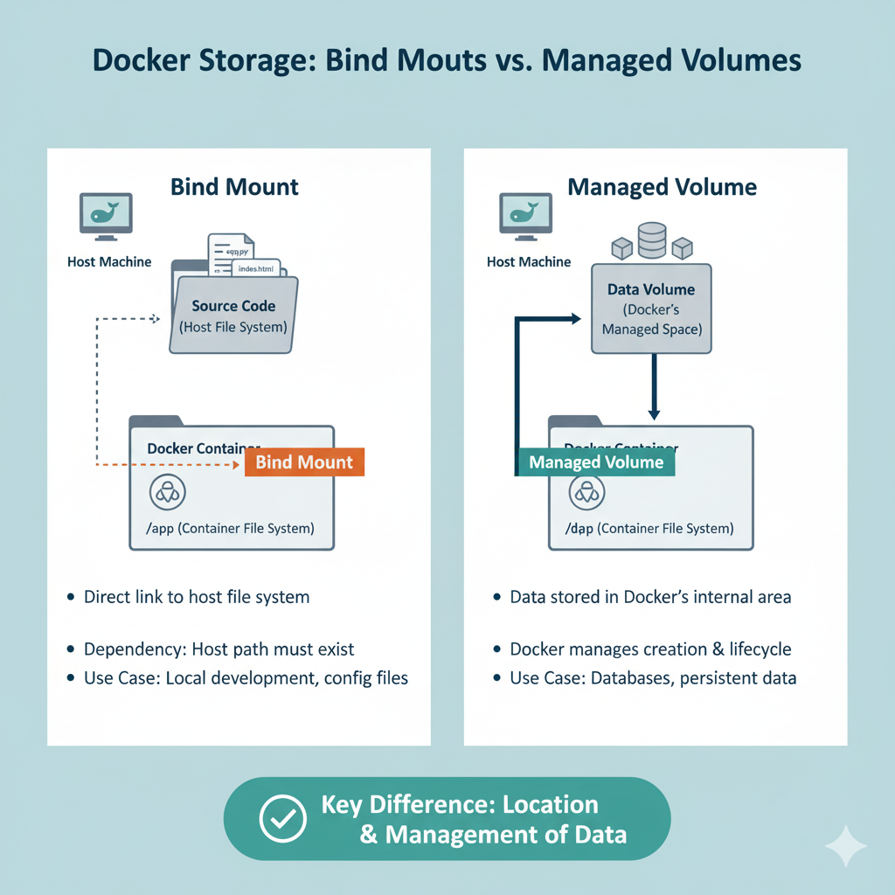

# Docker Level 3, Task 2: Persisting Data with Bind Mounts

Today's task was a crucial step in my Docker education. I moved beyond running simple, stateless containers and learned how to manage **persistent data**. The objective was to create a container and ensure that data placed on the host machine was accessible inside the container, and that this data would survive even if the container was deleted.

This introduced me to the concept of **Docker Volumes**, specifically a type called a **Bind Mount**. I learned how to "map" a directory from my host server directly into the container's filesystem. This is a fundamental skill for any stateful application, like a database, a web server that handles user uploads, or any application that needs to read configuration files from the host.

## Table of Contents
- [The Task](#the-task)
- [My Step-by-Step Solution](#my-step-by-step-solution)
- [Why Did I Do This? (The "What & Why")](#why-did-i-do-this-the-what--why)
- [Deep Dive: Bind Mounts vs. Docker-Managed Volumes](#deep-dive-bind-mounts-vs-docker-managed-volumes)
- [Common Pitfalls](#common-pitfalls)
- [Exploring the Commands Used](#exploring-the-commands-used)

---

### The Task
<a name="the-task"></a>
My objective was to create a container with persistent storage on **App Server 1**. The specific requirements were:
1.  Pull the `nginx` image.
2.  Create a container named `ecommerce`.
3.  Map a directory on the host server, `/opt/data`, to the `/home` directory inside the container.
4.  Copy a file, `/tmp/sample.txt`, into the host directory (`/opt/data`) so it would appear inside the container.
5.  Ensure the container was left in a running state.

---

### My Step-by-Step Solution
<a name="my-step-by-step-solution"></a>
The solution required me to prepare the host machine first, and then launch the container with the correct volume mapping flag.

#### Phase 1: Preparing the Host Server
I couldn't map a host directory that didn't exist, so I had to create it and populate it first.
1.  I connected to App Server 1: `ssh tony@stapp01`.
2.  I created the required host directory. I needed `sudo` because `/opt` is a system directory.
    ```bash
    sudo mkdir -p /opt/data
    ```
3.  I copied the sample file into this new directory.
    ```bash
    sudo cp /tmp/sample.txt /opt/data/
    ```

#### Phase 2: Running the Container with a Bind Mount
With the host directory ready, I could now launch my container.
1.  First, I pulled the latest `nginx` image to ensure it was available locally.
    ```bash
    sudo docker pull nginx:latest
    ```
2.  This was the core command of the task. I used the `-v` flag to create the bind mount.
    ```bash
    sudo docker run -d --name ecommerce -v /opt/data:/home nginx:latest
    ```

#### Phase 3: Verification
The most important part was to confirm that the data was actually visible inside the container.
1.  I first checked that the container was running: `sudo docker ps`. It showed the `ecommerce` container with an "Up" status.
2.  Then, I used `docker exec` to run a command *inside* the container to inspect its `/home` directory.
    ```bash
    sudo docker exec ecommerce ls -l /home
    ```
    The output listed the `sample.txt` file. This was the definitive proof that the mapping was successful. The file from my host's `/opt/data` directory was now visible inside the container's `/home` directory.

---

### Why Did I Do This? (The "What & Why")
<a name="why-did-i-do-this-the-what--why"></a>
-   **Ephemeral Containers**: By default, a container's filesystem is **ephemeral**. This means any data written inside the container (logs, user uploads, database files) is permanently deleted when the container is removed. This is a problem for any application that needs to save data.
-   **Docker Volumes**: This is the general term for the mechanism Docker uses to solve this problem. Volumes allow data to be stored *outside* the container's lifecycle, on the host machine.
-   **Bind Mounts**: This is a specific type of volume. A bind mount **maps** a file or directory from the host machine's filesystem directly into the container's filesystem. The path on the host can be anywhere. It's a direct, 1-to-1 link.
-   **The `-v` or `--volume` flag**: This is the flag used in the `docker run` command to create the mapping. The syntax is crucial: `-v /path/on/host:/path/in/container`. The host path always comes first.

---

### Deep Dive: Bind Mounts vs. Docker-Managed Volumes
<a name="deep-dive-bind-mounts-vs-docker-managed-volumes"></a>
This task used a bind mount, but there's another, more common type of volume called a **Docker-managed volume**. It's important to know the difference.



-   **Bind Mount (What I used today):**
    -   **How it works:** You specify a full path on the host machine (e.g., `/opt/data`). You are responsible for managing this directory.
    -   **Pros:** Very easy to understand. You can easily access and edit the files from the host machine using standard tools. Great for development environments or when you need to mount existing data into a container.
    -   **Cons:** It ties the container to a specific host directory structure. This makes your container less portable, as the same path might not exist on a different host. It can also lead to permission issues if the user inside the container doesn't have rights to the host directory.

-   **Docker-Managed Volume:**
    -   **How it works:** You give the volume a name (e.g., `my-app-data`) and Docker manages the actual storage location on the host (usually a directory deep inside `/var/lib/docker/volumes/`). You don't need to know the host path.
    -   **Command:** `docker volume create my-app-data` and then `docker run -v my-app-data:/path/in/container ...`
    -   **Pros:** This is the **recommended** approach for most production use cases. It decouples the container from the host's filesystem, making it more portable. Docker handles permissions and drivers, and you can easily back up, migrate, and manage these volumes using the Docker CLI.
    -   **Cons:** It's slightly more abstract, as you can't just `cd` into a simple path to see the data.

---

### Common Pitfalls
<a name="common-pitfalls"></a>
-   **Host Directory Doesn't Exist:** If the source directory for a bind mount (`/opt/data` in my case) doesn't exist, Docker will create it for you, but it will be created as `root`. This could cause permission problems later. It's always best practice to create and prepare the host directory first.
-   **Incorrect Path Order:** A very common mistake is to reverse the paths in the `-v` flag. The syntax is always `HOST:CONTAINER`.
-   **Permissions:** If the process inside the container runs as a non-root user, it might not have permission to write to the host directory that was created by `root`. This can lead to "Permission Denied" errors from the application.
-   **Forgetting `docker exec`:** The only way to be 100% sure the mount worked is to look *inside* the container. Just checking that the container is running is not enough.

---

### Exploring the Commands Used
<a name="exploring-the-commands-used"></a>
-   `sudo mkdir -p /opt/data`: **M**a**k**es a **dir**ectory. The `-p` flag creates parent directories if they don't exist, which is a good habit.
-   `sudo cp /tmp/sample.txt /opt/data/`: Standard Linux command to **c**o**p**y a file to a new location.
-   `sudo docker pull nginx:latest`: Downloads the `nginx` image with the `latest` tag from Docker Hub.
-   `sudo docker run -d --name ecommerce -v /opt/data:/home nginx:latest`: The main command of the task.
    -   `-d`: Runs the container in **d**etached mode.
    -   `--name`: Assigns a human-readable name.
    -   `-v /opt/data:/home`: Creates the bind mount, linking the host path to the container path.
-   `sudo docker exec ecommerce ls -l /home`: **Exec**utes a command (`ls -l /home`) inside the running `ecommerce` container to verify its contents.
  