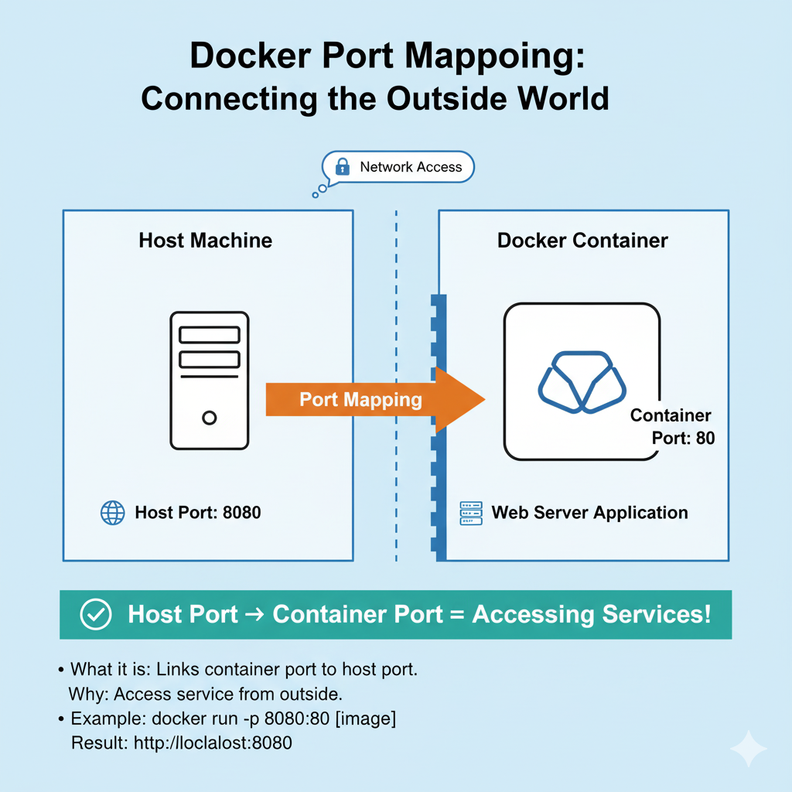

# Docker Level 3, Task 3: Exposing Container Services with Port Mapping

Today's task was about a fundamental concept that makes containers truly useful: networking. I learned how to take a service running inside an isolated container and make it accessible from the host server and the outside world. This is the bridge between the private, internal world of the container and the public network.

The core of the task was to deploy an Nginx web server and use Docker's **port mapping** feature to expose it. This is a critical skill for containerizing any kind of network-based application, from web servers and APIs to databases.

## Table of Contents
- [The Task](#the-task)
- [My Step-by-Step Solution](#my-step-by-step-solution)
- [Why Did I Do This? (The "What & Why")](#why-did-i-do-this-the-what--why)
- [Deep Dive: How Port Mapping Works Under the Hood](#deep-dive-how-port-mapping-works-under-the-hood)
- [Common Pitfalls](#common-pitfalls)
- [Exploring the Commands Used](#exploring-the-commands-used)

---

### The Task
<a name="the-task"></a>
My objective was to deploy a containerized Nginx web server on **App Server 1** and make it accessible on a custom port. The specific requirements were:
1.  Pull the `nginx:alpine` image.
2.  Create a container named `ecommerce`.
3.  Map port `6200` on the host server to port `80` inside the container.
4.  Ensure the container was left in a running state.

---

### My Step-by-Step Solution
<a name="my-step-by-step-solution"></a>
The process was very efficient, involving a single Docker command to launch and configure the container.

#### Step 1: Connect to the Server
First, I logged into App Server 1 as the `tony` user.
```bash
ssh tony@stapp01
```

#### Step 2: Pull the Image
As a best practice, I explicitly pulled the required image first to ensure it was available locally.
```bash
sudo docker pull nginx:alpine
```

#### Step 3: Run the Container with Port Mapping
This was the core command of the task. I used the `-p` flag to define the port mapping.
```bash
sudo docker run -d --name ecommerce -p 6200:80 nginx:alpine
```

#### Step 4: Verification
The most important part was to confirm that the container was running and the port was correctly mapped.
1.  **Check the Running Container:** I used `docker ps` to see the status.
    ```bash
    sudo docker ps
    ```
    The output was the definitive proof. I paid close attention to the `PORTS` column:
    `0.0.0.0:6200->80/tcp`
    This clearly showed that traffic arriving on all host interfaces (`0.0.0.0`) at port `6200` was being forwarded (`->`) to port `80` inside the container.

2.  **Test the Connection:** I then ran a local `curl` command to test the web server through the mapped port.
    ```bash
    curl http://localhost:6200
    ```
    I received the "Welcome to nginx!" HTML page, confirming that the entire setup was working perfectly.

---

### Why Did I Do This? (The "What & Why")
<a name="why-did-i-do-this-the-what--why"></a>
-   **Container Isolation**: A key feature of Docker is that containers run in their own isolated network namespace. A web server listening on port `80` inside a container is completely unreachable from the host machine by default. This is great for security but not very useful for a web server.
-   **Port Mapping (or "Publishing"):** This is the mechanism Docker provides to bridge this gap. It creates a forwarding rule that connects a port on the host machine's network interface to a port inside the container. This is what makes a container's services accessible to the outside world.
-   **The `-p` or `--publish` Flag**: This is the command-line flag used with `docker run` to configure port mapping. The syntax is critical: `-p <HOST_PORT>:<CONTAINER_PORT>`. The host port always comes first.
-   **`nginx:alpine` Image**: I used the `alpine` variant of the `nginx` image. This is a best practice. Alpine Linux is a minimal distribution, so `alpine`-based images are incredibly small (the `nginx:alpine` image is only a few MB). This means faster downloads, a smaller storage footprint, and improved security due to a reduced attack surface (fewer packages that could contain vulnerabilities).

---

### Deep Dive: How Port Mapping Works Under the Hood
<a name="deep-dive-how-port-mapping-works-under-the-hood"></a>
The `docker run -p` command seems simple, but it's actually doing something very powerful on the host machine. Docker interacts with the Linux kernel's networking stack, specifically a firewall utility called **`iptables`**, to create the forwarding rule.



Here's a simplified breakdown of what happens:
1.  When I run `docker run -p 6200:80 ...`, the Docker daemon adds a new rule to the `DOCKER` chain in the `nat` table of `iptables`.
2.  This rule is a **DNAT (Destination Network Address Translation)** rule.
3.  When a network packet arrives at the host machine's network interface with a destination port of `6200`, the `iptables` rule matches it.
4.  The DNAT rule then rewrites the packet's destination, changing it to the container's private IP address (e.g., `172.17.0.2`) and port `80`.
5.  The packet is then routed to the container's network interface.
6.  The Nginx server inside the container receives the packet on port `80` and responds. The response travels back through the same `iptables` path, with the source address being translated back, so the client sees the response as coming from the host.

This is why the Docker daemon requires root privileges—it needs to be able to manipulate these low-level kernel networking rules.

---

### Common Pitfalls
<a name="common-pitfalls"></a>
-   **Forgetting the `-d` Flag:** If I had forgotten to run the container in detached (`-d`) mode, it would have started in the foreground, and my terminal would have been attached to the Nginx logs. Closing my terminal would have then stopped the container.
-   **Reversing the Ports:** A very common mistake is to write `-p 80:6200`. This would try to map the host's port 80 to the container's port 6200. Since Nginx isn't listening on port 6200 inside the container, this would not work.
-   **Port Conflict on the Host:** If another service was already running on port `6200` on my host server, the `docker run` command would have failed with an "address already in use" or "port is already allocated" error.
-   **Forgetting to Verify:** Just seeing the `docker run` command succeed is not enough. The only way to be sure the application is working is to test the connection with a tool like `curl` or a web browser.

---

### Exploring the Commands Used
<a name="exploring-the-commands-used"></a>
-   `sudo docker pull nginx:alpine`: Downloads the `nginx` image with the `alpine` tag from the default registry (Docker Hub).
-   `sudo docker run -d --name ecommerce -p 6200:80 nginx:alpine`: The primary command of the task.
    -   `-d`: Runs the container in **d**etached (background) mode.
    -   `--name`: Assigns a human-readable name to the container.
    -   `-p 6200:80`: **P**ublishes the port, mapping the host's port 6200 to the container's port 80.
-   `sudo docker ps`: **P**rinter **S**tatus. Lists all *running* Docker containers. I used this to verify that my container was running and to check the `PORTS` column for the correct mapping.
-   `curl http://localhost:6200`: A command-line tool for making web requests. I used it to make a request to my host's port 6200 to confirm that the Nginx server inside the container was responding.
  