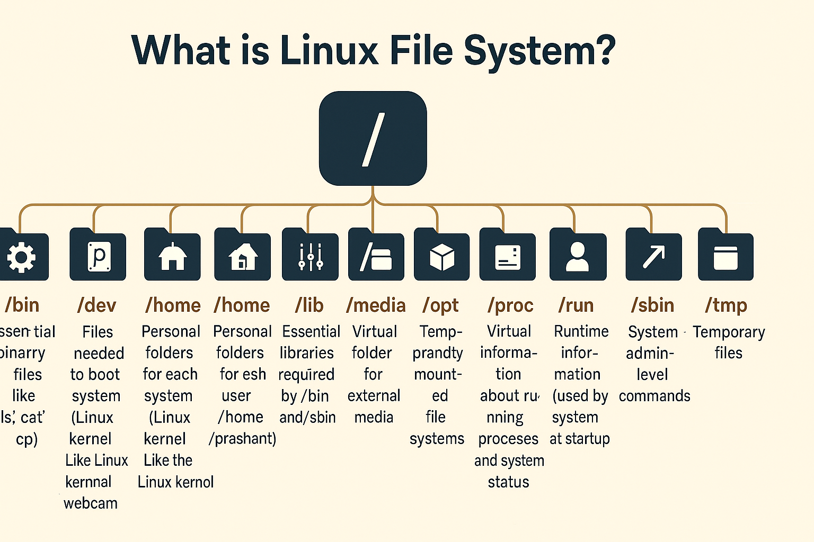

# December 03 2025

A comprehensive mastery guide derived from practical lab notes (Dec 3rd) and expanded with industry-standard Linux Administrator knowledge. This guide is structured to take you from understanding the core kernel to managing complex systems.

## Table of Contents

- [December 03 2025](#december-03-2025)
  - [Table of Contents](#table-of-contents)
  - [Phase 1: Linux Fundamentals \& Architecture](#phase-1-linux-fundamentals--architecture)
    - [The Operating System \& Kernel](#the-operating-system--kernel)
    - [The Boot Process (GRUB)](#the-boot-process-grub)
    - [The File System Hierarchy](#the-file-system-hierarchy)
  - [Phase 2: The Shell Environment](#phase-2-the-shell-environment)
    - [Understanding the Shell](#understanding-the-shell)
    - [Environment Variables \& PATH](#environment-variables--path)
    - [Configuration: .bashrc](#configuration-bashrc)
  - [Phase 3: Package Management](#phase-3-package-management)
    - [Package Managers (APT/DNF)](#package-managers-aptdnf)
  - [Phase 4: User \& Security Management](#phase-4-user--security-management)
    - [User Lifecycle (Add/Mod/Del)](#user-lifecycle-addmoddel)
    - [Group Management](#group-management)
    - [Critical Files: passwd \& shadow](#critical-files-passwd--shadow)
    - [Sudoers \& Privileges](#sudoers--privileges)
    - [File Permissions (chmod/chown)](#file-permissions-chmodchown)
  - [Phase 5: Disk \& Storage Administration](#phase-5-disk--storage-administration)
    - [Disk Usage (df vs du)](#disk-usage-df-vs-du)
    - [Mounting \& Partitions (lsblk/mount)](#mounting--partitions-lsblkmount)
  - [Phase 6: Networking \& Data Transfer](#phase-6-networking--data-transfer)
    - [The curl Command](#the-curl-command)
    - [wget](#wget)
    - [rsync (Synchronization)](#rsync-synchronization)
  - [Phase 7: Advanced Shell Operations](#phase-7-advanced-shell-operations)
    - [Redirection \& Pipes](#redirection--pipes)
    - [Text Processing (sed)](#text-processing-sed)
    - [Archiving (tar, zip)](#archiving-tar-zip)
  - [Phase 8: Text Editing (Vim)](#phase-8-text-editing-vim)

---

<br>
<br>

## Phase 1: Linux Fundamentals & Architecture
<a name="phase-1-linux-fundamentals--architecture"></a>

### The Operating System & Kernel

**What is an OS?**
An Operating System (OS) is system software that acts as a bridge between the user and the computer hardware. It manages resources like CPU, Memory (RAM), and Storage.

**What is Linux?**
Linux is technically **just the Kernel**. When we say "Linux OS", we are referring to a **Distribution (Distro)** which combines:
1.  **The Linux Kernel** (The core)
2.  **System Tools** (Compilers, libraries)
3.  **Applications** (Shell, GUI, Server software)

**The Kernel**
The kernel is a program written in low-level languages (like C) that has direct access to hardware.
* **Role**: Manages processes, memory allocation, device I/O, and the file system.
* **Why it's needed**: Users cannot talk to hardware directly; it is unsafe. The kernel acts as the secure intermediary.

---
<br>
<br>

### The Boot Process (GRUB)
<a name="the-boot-process-grub"></a>

How does Linux start?
- When you turn on your system, Linux doesn’t just magically appear. There’s a clear startup chain behind the scenes.

- First, the machine **powers on** and your **BIOS/UEFI** does its quick hardware check to make sure everything looks fine. Once that’s done, it hands control over to the **bootloader** — and on Linux, that’s usually **GRUB**.

GRUB’s job is pretty simple but critical: it **decides what to boot**. If you have multiple operating systems, this is where you pick one. If you don’t, GRUB silently loads the Linux kernel with the right parameters.

After GRUB **loads the kernel into memory**, the kernel takes over completely. It initializes hardware, sets up drivers, mounts the root file system, and then starts the very first user-space process — usually systemd. From there, systemd starts all essential services, logs, networking, and everything else your system needs to come alive.

And that’s the boot process in a nutshell.

GRUB itself?
It stands for GRand Unified Bootloader, and it’s basically the middle-man between your firmware and your operating system, controlling what boots and how it boots.

What is a firmware?
- Firmware is the tiny, low-level software stored on your motherboard (BIOS or UEFI). Its job is simple: wake up the hardware, check that everything works, and then pass control to the bootloader.


---

<br>
<br>

### The File System Hierarchy
<a name="the-file-system-hierarchy"></a>

Linux follows a strict directory structure. Here is what every Admin must know:



| Directory | Purpose |
| :--- | :--- |
| **/** | The Root directory. The top of the tree. |
| **/root** | Home directory for the **root** (admin) user. (Not the same as `/`). |
| **/home** | Home directories for normal users (e.g., `/home/john`). |
| **/bin** | **Essential** User Binaries (commands like `ls`, `cp`, `cat`). |
| **/sbin** | **System** Binaries. Admin-only commands (e.g., `reboot`, `iptables`, `fdisk`). |
| **/etc** | **Configuration** files. (e.g., `/etc/passwd`, `/etc/ssh/sshd_config`). |
| **/var** | **Variable** data. Files that grow/change (Logs `/var/log`, Web files `/var/www`). |
| **/tmp** | **Temporary** files. Often cleared on reboot. |
| **/dev** | **Device** files. Represents hardware (e.g., `/dev/sda` is a hard drive). |
| **/proc** | **Process** information. A virtual filesystem reflecting kernel state. |
| **/opt** | **Optional** add-on software (Google Chrome, proprietary apps). |
| **/mnt** | **Mount** point for temporary filesystems (USB sticks, test drives). |
| **/media** | Automount point for removable media (CD-ROMs). |
| **/lib** | Shared libraries needed by binaries in `/bin` and `/sbin`. |

---
<br><br>

## Phase 2: The Shell Environment
<a name="phase-2-the-shell-environment"></a>

### Understanding the Shell
The shell is the user interface to the kernel. You type a command, the shell interprets it, and tells the kernel what to do.
* **Common Shells**: Bash (Standard), Zsh (Modern features), Sh (Legacy).

### Environment Variables & PATH
<a name="environment-variables--path"></a>

**What is the `PATH`?**
The `PATH` variable tells the shell **where to look** for executable programs. It is a list of directories separated by colons (`:`).

**How it works:**
When you type `ls`:
1.  Linux looks in `/usr/local/bin`. Is `ls` there? No.
2.  Linux looks in `/usr/bin`. Is `ls` there? Yes.
3.  Linux runs `/usr/bin/ls`.

**Commands:**
```bash
# View current PATH
echo $PATH

# Temporarily add a folder to PATH (Lost after closing terminal)
export PATH=$PATH:/opt/myapp/bin
```

### Configuration: .bashrc
<a name="configuration-bashrc"></a>

* **File**: `~/.bashrc` (Located in user's home directory).
* **Purpose**: Every time you open a new terminal session, Bash reads this file and applies whatever settings you’ve put inside.
  * This is where you add things like **aliases**, **custom prompts**, **environment variables**, or **functions** you want available every time you open a shell. It’s your place to tweak how your terminal behaves without affecting the whole system.

**How to make changes permanent:**
1.  Open file: `nano ~/.bashrc`
2.  Add line: `export PATH=$PATH:/opt/myapp/bin`
3.  Save and Exit.
4.  **Apply changes**: `source ~/.bashrc`

---

<br>
<br>

## Phase 3: Package Management
<a name="phase-3-package-management"></a>

Software in Linux is managed via repositories to ensure security and dependency handling.

### Package Managers (APT/DNF)

**Debian/Ubuntu uses `apt`**:
```bash
sudo apt update          # Refresh repository list
sudo apt upgrade         # Update all installed software
sudo apt install nginx   # Install a package
sudo apt remove nginx    # Remove a package
```

**RHEL/CentOS/Rocky uses `dnf` (or `yum`):**
```bash
sudo dnf check-update    # Check for updates
sudo dnf update          # Update system
sudo dnf install httpd   # Install a package
sudo dnf remove httpd    # Remove a package
```

**Repositories**: Secure servers where the package manager downloads software from.

---

<br>
<br>

## Phase 4: User & Security Management
<a name="phase-4-user--security-management"></a>

### User Lifecycle (Add/Mod/Del)

**Creating Users:**
```bash
# Create user 'john' AND create his home directory (-m)
sudo useradd -m john

# Set a password for john (useradd does not do this automatically)
sudo passwd john
```

**Modifying Users (`usermod`):**
```bash
# Add john to the 'docker' group (-a = append, -G = group)
sudo usermod -aG docker john
# if i dont specify -a flag, it will remove user from other groups and add only to specified group

# Change john's default shell to bash
sudo usermod -s /bin/bash john

# Change john's home directory to /home/johnny and move files (-m)
sudo usermod -d /home/johnny -m john
# -d : change home directory
# -m : move contents from old home to new home

# View user info
id john

# View groups of a user
groups john

# View all users
cat /etc/passwd

# View all groups
cat /etc/group

# View last logged in users
last

# View currently logged in users
who

# View currently logged in users with more details
w

# View user login history
lastlog

# View failed login attempts
sudo cat /var/log/faillog

# Set expiration date for user account
sudo chage -E 2025-12-31 john

# View user info
sudo chage -l john

# Force user to change password on next login
sudo chage -d 0 john
# -d : last password change date and 0 means force change on next login

# Lock user account (disable login)
sudo usermod -L john
# -L : lock account

# Unlock user account
sudo usermod -U john
# -U : unlock account
```

**Deleting Users (`userdel`):**
```bash
# Delete user 'john' AND his home directory (-r)
sudo userdel -r john

# Delete user 'john' but keep his home directory
sudo userdel john

# Force delete user 'john' even if logged in
sudo userdel -f john

# View deleted users (if any)
sudo cat /etc/shadow | grep '!!'
# /etc/shadow file? Stores encrypted passwords and account status.
```

### Group Management
* **Primary Group**: The default group files belong to when you create them (usually same as username).
* **Secondary Group**: Extra groups for permissions (e.g., `sudo`, `docker`, `admin`).

```bash
sudo groupadd developers       # Create a group
sudo usermod -aG developers ali # Add user to group
groups ali                     # View user's groups

# Remove user from group
sudo gpasswd -d ali developers
# -d : delete user from group

# Delete a group
sudo groupdel developers

# View all groups
cat /etc/group

# View group members
getent group developers

# View groups of a user
groups ali

# View primary group of a user
id ali
id -gn ali
# -g : primary group
# -n : show name instead of GID
```

### Critical Files: passwd & shadow
<a name="critical-files-passwd--shadow"></a>

1.  **`/etc/passwd`**:
    * Stores user account details (UID, GID, Home Dir, Shell).
    * **Readable by everyone**.
    * Format: `user:x:1000:1000:comment:/home/user:/bin/bash`
2.  **`/etc/shadow`**:
    * Stores **Encrypted Passwords** and expiration rules.
    * **Readable only by root**.
    * This separation exists for security.

### Sudoers & Privileges
**`visudo`**: The command used to safely edit the `/etc/sudoers` file. It prevents syntax errors that could lock you out of the system.

Q. What is `/etc/sudoers` file?
- The `/etc/sudoers` file is a configuration file for the sudo command in Unix-like operating systems. It defines which users or groups have permission to execute commands with superuser (root) privileges, and under what conditions. The file specifies the rules and policies for granting elevated access to users, allowing them to perform administrative tasks without needing to log in as the root user directly.

**NOPASSWD Rule**:
To allow a user to run a specific command without typing a password:

```bash
# Inside sudoers file
john ALL=(ALL) NOPASSWD: /usr/bin/systemctl restart nginx
# restart nginx without password
# ALL : from any host
# (ALL) : as any user
# what is host here : in case of networked systems, it specifies from which machines the user can run sudo commands.
```

### File Permissions (chmod/chown)

**Ownership (`chown`)**:
```bash
# Change owner of file to 'john'
sudo chown john file.txt

# Change owner to 'john' and group to 'devs' recursively
sudo chown -R john:devs /var/www/html

# View file ownership and permissions
ls -l file.txt
# -l : long listing format

# Change only group of a file
sudo chown :devs file.txt

# Change only owner of a file
sudo chown john: file.txt

# View current user and group
whoami        # Current user
id            # Current user and group
id -gn        # Primary group name
id -G         # All group IDs
id -Gn        # All group names

# View file owner and group
stat file.txt

# View only owner
stat -c %U file.txt

# View only group
stat -c %G file.txt
```

**Permissions (`chmod`)**:
Read (r=4), Write (w=2), Execute (x=1).

```bash
# Give User (u) Read/Write/Execute (7), Group (g) Read/Execute (5), Others (o) Read (4)
chmod 754 script.sh

# Make a file executable
chmod +x script.sh

# Remove write permission for group
chmod g-w file.txt

# Recursively set permissions
chmod -R 755 /var/www/html
# where it will apply : to all files and folders inside /var/www/html
```

---

<br>  
<br>

## Phase 5: Disk & Storage Administration
<a name="phase-5-disk--storage-administration"></a>

### Disk Usage (df vs du)

**`df` (Disk Free)**:
Checks the **filesystem** level. Shows total block availability.
```bash
df -h          # Human readable sizes (GB, MB)
df -h /home    # Check specific partition
df -i          # Check Inode usage (file count limit)

# View mounted filesystems
mount | column -t

# View filesystem types
df -T

# View disk usage of a specific filesystem type (e.g., ext4)
df -h -t ext4
# -t : type AND -h : human readable

# View disk usage excluding a specific filesystem type (e.g., tmpfs)
df -h -x tmpfs
# -x : exclude AND -h : human readable

# View disk usage of all filesystems including pseudo, duplicate, inaccessible
df -a
# -a : all filesystems
# pseudo : virtual filesystems like /proc, /sys
# duplicate : multiple mount points for same filesystem
# inaccessible : filesystems that cannot be accessed due to permissions

# View disk usage inodes of all filesystems
df -i
# -i : inodes
# inodes : data structures that store information about files (metadata)

# View disk usage inodes of a specific filesystem
df -i /home

# View disk usage inodes excluding a specific filesystem type (e.g., tmpfs)
df -i -x tmpfs

# View disk usage inodes of a specific filesystem type (e.g., ext4)
df -i -t ext4
```

**`du` (Disk Usage)**:
Checks actual **file/directory** sizes.
```bash
du -sh /var/log    # Summary (-s) Human-readable (-h) size of folder
du -h --max-depth=1 /var  # Find which subfolder is eating space

# Find largest files/folders in current directory
du -ah . | sort -rh | head -n 10
# -a : all files AND folders
# sort -rh : sort by size in reverse order (largest first)
# head -n 10 : show top 10 results

# View disk usage of a specific file
du -h file.txt

# View disk usage of all files and directories recursively
du -h /path/to/directory

# View disk usage excluding a specific directory (e.g., /var/log)
du -h --exclude=/var/log /var

# View disk usage including hidden files
du -ah /path/to/directory
# -a : all files including hidden files AND folders

# View disk usage excluding hidden files
du -h --exclude=".*" /path/to/directory

# View disk usage of a specific file type (e.g., .log files)
du -h --include="*.log" /var/log

# View disk usage excluding a specific file type (e.g., .tmp files)
du -h --exclude="*.tmp" /var/log

# Compare df and du for /var/log
df -h /var/log
du -h /var/log 
# df shows filesystem level usage, du shows actual file sizes.
```

**Why they differ**: If you delete a large log file but a process is still writing to it, `df` won't show the space as free until the process is killed. `du` will show it as gone.

### Mounting & Partitions (lsblk/mount)

**`lsblk`**: Lists all block devices (disks/partitions) in a tree view.
```bash
lsblk -f       # Also shows filesystem types (ext4, xfs)

# View detailed info including UUIDs
lsblk -o NAME,FSTYPE,SIZE,MOUNTPOINT,UUID
# -o : output specific columns
# NAME : device name
# FSTYPE : filesystem type
# SIZE : size of the device
# MOUNTPOINT : where it is mounted
# UUID : unique identifier

# View only mounted devices
lsblk -l | grep -v "MOUNTPOINT"

# View only unmounted devices
lsblk -l | grep "MOUNTPOINT" | grep -v "/"

# View devices of a specific type (e.g., disk)
lsblk -d -o NAME,SIZE,TYPE | grep disk
# -d : only show disks (no partitions)

# View devices excluding a specific type (e.g., loop devices)
lsblk -e 7 -o NAME,SIZE,TYPE
# -e : exclude type (7 = loop devices)
```

**`mount` / `umount`**:
Attaching a storage device to a folder (Mount Point).
```bash
# Mount /dev/sdb1 to /mnt
sudo mount /dev/sdb1 /mnt

# Verify mount
df -h | grep /mnt

# List all mounts
mount | column -t

# Unmount
sudo umount /mnt

# Force unmount (if busy)
sudo umount -l /mnt
# -l : lazy unmount
# what is lazy unmount : detaches the filesystem immediately but cleans up references when no longer busy.

# Mount with specific options (read-only)
sudo mount -o ro /dev/sdb1 /mnt
# -o : options AND ro : read-only
# what this will do : prevents any write operations to the mounted filesystem.

# Mount with specific options (read-write)
sudo mount -o rw /dev/sdb1 /mnt

# View mount options
mount | grep /mnt

# Mount with specific filesystem type (e.g., ntfs)
sudo mount -t ntfs /dev/sdb1 /mnt
# -t : type

# View all mounted filesystems with types
mount -t

# View all mounted filesystems excluding a specific type (e.g., tmpfs)
mount | grep -v "tmpfs"

# Make a mount permanent (edit /etc/fstab)
sudo nano /etc/fstab

# Example entry in /etc/fstab:
# /dev/sdb1   /mnt   ext4   defaults   0 2
# /dev/sdb1 : device to mount
# /mnt : mount point
# ext4 : filesystem type
# defaults : mount options : use default options like read-write, auto-mount at boot.
# 0 : dump (backup) option : whether to back up the filesystem (0 = no, 1 = yes).
# 2 : fsck order (filesystem check order): what is fsck : a system utility that checks and repairs filesystem inconsistencies during boot.
```

**`/etc/fstab`**: The file used to make mounts permanent across reboots.

---

<br>
<br>

## Phase 6: Networking & Data Transfer
<a name="phase-6-networking--data-transfer"></a>

### The curl Command
Versatile tool for transferring data via URL.

```bash
# Download and save with original name
curl -O https://example.com/file.zip
# -O : uppercase O means save with original filename

# Download and rename
curl -o newname.zip https://example.com/file.zip
# -o : lowercase o means save with specified filename

# Test an API (GET)
curl https://api.example.com/users
# Default method is GET
# what is GET : a request method used to retrieve data from a specified resource.
# what this command will do : fetches the list of users from the API endpoint.
# what is an API : Application Programming Interface, a set of rules that allows different software applications to communicate with each other.
# why use curl for APIs : curl allows you to easily send HTTP requests and view responses directly from the command line, making it a useful tool for testing and interacting with APIs.

# Send Data (POST)
curl -X POST -d "user=john" https://api.site.com
# -X : specify method AND -d : data to send
# what is POST : a request method used to send data to a server to create/update a resource.
# what this command will do : sends a POST request to the API endpoint with the data "user=john".

# Check Headers only (Debug server issues)
curl -I https://google.com
# -I : fetch headers only
# what are headers : metadata sent by the server that provides information about the response, such as content type, server type, and caching policies.
# why check headers : to diagnose server issues, verify content types, and understand caching behavior.

# Follow redirects
curl -L http://bit.ly/example
# -L : follow redirects
# what are redirects : instructions from the server to the client to fetch the requested resource from a different URL.
# why follow redirects : to ensure you reach the final destination of a shortened or moved URL.

# Download with progress bar
curl -# -O https://example.com/largefile.iso
# -# : show progress bar
# what this command will do : downloads a large file while displaying a progress bar to indicate download status.

# Upload a file via FTP
curl -T localfile.txt ftp://ftp.example.com --user username:password
# -T : upload file
# what this command will do : uploads 'localfile.txt' to the specified FTP server using the provided credentials.
# --user : specify username and password for authentication

# Set custom headers
curl -H "Authorization: Bearer token123" https://api.secure.com/data
# -H : add header
# what this command will do : sends a GET request to the secure API endpoint with an authorization header for access.
# why use custom headers : to include additional information in the request, such as authentication tokens or content types.

# Download multiple files
curl -O https://example.com/file1.zip -O https://example.com/file2.zip

# Limit download speed
curl --limit-rate 500k -O https://example.com/largefile.iso
# --limit-rate : limit download speed
# what this command will do : downloads a large file while limiting the download speed to 500 KB/s.

# Resume interrupted download
curl -C - -O https://example.com/largefile.iso
# -C - : continue/resume download
# what this command will do : resumes downloading a large file from where it was interrupted.

# View verbose output (debugging)
curl -v https://example.com
# -v : verbose output
# what this command will do : provides detailed information about the request and response process, useful for debugging.

# Use a proxy server
curl -x http://proxyserver:8080 -O https://example.com/file.zip
# -x : specify proxy server
# what this command will do : downloads a file through the specified proxy server.

# Send JSON data
curl -X POST -H "Content-Type: application/json" -d '{"name":"john","age":30}' https://api.example.com/users
# -H : add header AND -d : data to send
# what this command will do : sends a POST request with JSON data to create a new user on the API endpoint.

# Save output to a file
curl https://example.com/data -o output.txt
# -o : specify output file
# what this command will do : fetches data from the URL and saves it to 'output.txt'.

# Follow redirects and save to file
curl -L https://bit.ly/example -o finalfile.txt
# -L : follow redirects AND -o : specify output file
# what this command will do : follows any redirects from the shortened URL and saves the final content to 'finalfile.txt'.

# Upload multiple files via FTP
curl -T "{file1.txt,file2.txt}" ftp://ftp.example.com --user username:password
# -T : upload files
# what this command will do : uploads both 'file1.txt' and 'file2.txt' to the specified FTP server using the provided credentials.

# Use HTTP Basic Authentication
curl -u username:password https://secure.example.com/data
# -u : specify username and password
# what this command will do : accesses a secure URL using HTTP Basic Authentication with the provided credentials

# Set a timeout for the request
curl --max-time 10 -O https://example.com/largefile.iso
# --max-time : set maximum time for the request in seconds
# what this command will do : attempts to download a large file but will timeout if it takes longer than 10 seconds.

# Use cookies
curl -b cookies.txt -O https://example.com/profile
# -b : send cookies from file
# what this command will do : downloads the profile page while sending cookies stored in 'cookies.txt'.

# Save cookies
curl -c cookies.txt -O https://example.com/login
# -c : save cookies to file
# what this command will do : downloads the login page and saves any cookies received to 'cookies.txt'.

# Perform a HEAD request
curl -I https://example.com
# -I : fetch headers only
# what this command will do : retrieves only the headers from the specified URL without downloading the body.

# Use HTTP/2
curl --http2 -O https://example.com/file.zip
# --http2 : use HTTP/2 protocol
# what this command will do : downloads a file using the HTTP/2 protocol, which can offer performance improvements over HTTP/1.1.
```

### wget
Simpler tool, primarily for downloading files.
```bash
wget https://example.com/file.iso
# what this command will do : downloads 'file.iso' from the specified URL.

# Download and save with a different name
wget -O newname.iso https://example.com/file.iso
# what this command will do : downloads 'file.iso' from the specified URL and saves it as 'newname.iso'.

# Download in the background
wget -b https://example.com/largefile.iso
# what this command will do : downloads a large file in the background, allowing you to continue using the terminal.

# Limit download speed
wget --limit-rate=500k https://example.com/largefile.iso
# what this command will do : downloads a large file while limiting the download speed to 500 KB/s.

# Resume interrupted download
wget -c https://example.com/largefile.iso

# what is the difference between curl and wget : curl is a versatile tool for transferring data with support for various protocols and complex operations, while wget is primarily focused on downloading files from the web with simpler usage.
```

### rsync (Synchronization)
The gold standard for backups. It only copies **changed** parts of files.

```bash
# Local Copy (Archive mode -a, Verbose -v)
rsync -av /source/ /destination/
# what is archive mode : a combination of options that preserves symbolic links, permissions, timestamps, and recursively copies directories.
# trailing slash on source : means copy contents of the source directory, not the directory itself.

# Remote Copy (Push to server)
rsync -av /local/data/ user@192.168.1.50:/remote/backup/
# what this command will do : copies the contents of '/local/data/' to the remote server at '192.168.1.50' in the '/remote/backup/' directory.

# Remote Copy (Pull from server)
rsync -av user@192.168.1.50:/remote/backup/ /local/data/
# what this command will do : copies the contents of '/remote/backup/' from the remote server at '192.168.1.50' to the local directory '/local/data/'.

# Delete files in destination that are not in source
rsync -av --delete /source/ /destination/
# --delete : delete extraneous files from destination
# what this command will do : synchronizes '/source/' to '/destination/' and removes any files in '/destination/' that are not present in '/source/'.
```

---

<br>
<br>

## Phase 7: Advanced Shell Operations
<a name="phase-7-advanced-shell-operations"></a>

### Redirection & Pipes

| Symbol | Name | Function | Example |
| :--- | :--- | :--- | :--- |
| `>` | Output Redirection | Sends output to file (Overwrites). | `ls > file.txt` |
| `>>` | Append Redirection | Adds output to end of file. | `date >> log.txt` |
| `<` | Input Redirection | Feeds file content to command. | `wc -l < file.txt` |
| `2>` | Error Redirection | Sends error messages to file. | `ls wrongfile 2> error.log` |
| `|` | Pipe | Sends output of Cmd1 to Input of Cmd2. | `cat file.txt | grep "Error"` |

### Text Processing (sed)
**Stream Editor**: Used for programmatic text editing.

```bash
# Replace 'old' with 'new' (Output only)
sed 's/old/new/' file.txt
# s : substitute

# Replace ALL occurrences globally (g)
sed 's/old/new/g' file.txt
# g : global replacement

# Delete line 3
sed '3d' file.txt
# d : delete

# EDIT THE FILE IN-PLACE (-i) - Dangerous, use with care!
sed -i 's/error/fixed/g' log.txt

# Print only lines matching 'pattern'
sed -n '/pattern/p' file.txt
# p : print matching lines
# -n : suppress automatic printing

# Insert text before line 2
sed '2i\This is inserted text.' file.txt
# i : insert
# what this command will do : inserts the specified text before line 2 of 'file.txt'.

# Append text after line 4
sed '4a\This is appended text.' file.txt
#  a : append
# what this command will do : appends the specified text after line 4 of 'file.txt'.

# Replace only on lines matching a pattern
sed '/pattern/s/old/new/g' file.txt
# what this command will do : replaces 'old' with 'new' only on lines that contain 'pattern' in 'file.txt'.

# Print line numbers with output
sed '=' file.txt | sed 'N;s/\n/ /'
# what this command will do : prints each line of 'file.txt' preceded by its line number.
# N : append next line to pattern space AND s/\n/ / : replace newline with space
# This is useful for referencing specific lines in a file.

# Replace only the 2nd occurrence of 'old' with 'new' in each line
sed 's/old/new/2' file.txt
# what this command will do : replaces only the second occurrence of 'old' with 'new' in each line of 'file.txt'.
# 2 : occurrence number

# Delete lines between line 3 and 5 (inclusive)
sed '3,5d' file.txt
# what this command will do : deletes lines 3 to 5 from 'file.txt'.
# , : range AND d : delete

# Replace 'foo' with 'bar' only on lines 10 to 20
sed '10,20s/foo/bar/g' file.txt
# what this command will do : replaces 'foo' with 'bar' only on lines 10 to 20 of 'file.txt'.
# , : range AND s : substitute

# Print lines 5 to 10
sed -n '5,10p' file.txt
# what this command will do : prints only lines 5 to 10 from 'file.txt'.
# -n : suppress automatic printing AND p : print matching lines

# Replace 'apple' with 'orange' only on lines containing 'fruit'
sed '/fruit/s/apple/orange/g' file.txt
# what this command will do : replaces 'apple' with 'orange' only on lines containing 'fruit' in 'file.txt'.
# /pattern/ : match lines containing pattern AND s : substitute
```

### Archiving (tar, zip)

**`tar` (Tape Archive)**:
* **Create**: `tar -cvf archive.tar files/`
* **Extract**: `tar -xvf archive.tar`
* **List contents**: `tar -tvf archive.tar`
  * -c : create
  * -x : extract
  * -t : list contents
  * -v : verbose
  * -f : file name
* **Compress (gzip)**: `tar -czvf archive.tar.gz files/`
* **Decompress (gzip)**: `tar -xzvf archive.tar.gz`
  * **Compress (bzip2)**: `tar -cjvf archive.tar.bz2 files/`
  * **Decompress (bzip2)**: `tar -xjvf archive.tar.bz2`
    * j : bzip2 compression
* **Extract (gzip)**: `tar -xzvf archive.tar.gz`

**`zip`**:
* **Zip**: `zip -r data.zip folder/`
  * -r : recursive
* **Unzip**: `unzip data.zip -d /target/folder`
  * -d : destination folder
* **List contents**: `unzip -l data.zip`
  * -l : list contents
* **Add to existing zip**: `zip data.zip newfile.txt`
* **Remove from zip**: `zip -d data.zip file.txt`
  * -d : delete from zip
* **Update zip**: `zip -u data.zip updatedfile.txt`
  * -u : update
* **Test zip integrity**: `unzip -t data.zip`
  * -t : test integrity
* **Encrypt zip**: `zip -e secure.zip file.txt`
  * -e : encrypt

---

<br>
<br>

## Phase 8: Text Editing (Vim)
<a name="phase-8-text-editing-vim"></a>

Vim is a modal editor. You are always in one of 3 modes:

1.  **Command Mode (Default)**:
    * `dd`: Delete (Cut) line.
    * `yy`: Yank (Copy) line.
    * `p`: Paste.
    * `u`: Undo.
    * `x`: Delete character.

2.  **Insert Mode (Typing)**:
    * Press `i` to start typing.
    * Press `Esc` to go back to Command Mode.

3.  **Last Line Mode (Saving)**:
    * Press `:` to enter.
    * `:w`: Save.
    * `:q`: Quit.
    * `:wq`: Save and Quit.
    * `:q!`: Force Quit (No save).

---