# Mastering REST APIs: A Comprehensive Guide for DevOps

In the world of modern software and infrastructure, nearly everything is connected through APIs (Application Programming Interfaces). For a DevOps engineer, understanding REST (REpresentational State Transfer) APIs is not just a useful skill—it is an absolute necessity. REST is the architectural style that powers the vast majority of web services, from cloud providers and CI/CD tools to monitoring platforms. This guide provides a complete, zero-to-hero walkthrough of REST API principles and practices.

---

### Table of Contents
- [Mastering REST APIs: A Comprehensive Guide for DevOps](#mastering-rest-apis-a-comprehensive-guide-for-devops)
    - [Table of Contents](#table-of-contents)
  - [Part 1: The Absolute Basics](#part-1-the-absolute-basics)
    - [What is an API?](#what-is-an-api)
    - [What is REST?](#what-is-rest)
    - [Why REST is Critical for DevOps](#why-rest-is-critical-for-devops)
  - [How HTTP Works?](#how-http-works)
  - [Part 2: The Core Principles of REST](#part-2-the-core-principles-of-rest)
    - [Client-Server Architecture](#client-server-architecture)
    - [Statelessness](#statelessness)
    - [Uniform Interface](#uniform-interface)
  - [Part 3: Anatomy of an API Interaction](#part-3-anatomy-of-an-api-interaction)
    - [The Request: What the Client Sends](#the-request-what-the-client-sends)
    - [The Response: What the Server Sends Back](#the-response-what-the-server-sends-back)
  - [Part 4: HTTP Methods - The Verbs of REST](#part-4-http-methods---the-verbs-of-rest)
    - [`GET`: Retrieve a Resource](#get-retrieve-a-resource)
    - [`POST`: Create a New Resource](#post-create-a-new-resource)
    - [`PUT`: Replace a Resource](#put-replace-a-resource)
    - [`PATCH`: Partially Update a Resource](#patch-partially-update-a-resource)
    - [`DELETE`: Remove a Resource](#delete-remove-a-resource)
  - [Part 5: HTTP Status Codes - The API's Feedback](#part-5-http-status-codes---the-apis-feedback)
    - [Understanding Code Categories (2xx, 4xx, 5xx)](#understanding-code-categories-2xx-4xx-5xx)
  - [Part 6: Authentication and Security](#part-6-authentication-and-security)
    - [Basic Authentication](#basic-authentication)
    - [API Keys](#api-keys)
    - [OAuth 2.0 and Bearer Tokens](#oauth-20-and-bearer-tokens)
  - [Part 7: Best Practices in API Design and Usage](#part-7-best-practices-in-api-design-and-usage)
    - [URI Naming Conventions](#uri-naming-conventions)
    - [API Versioning](#api-versioning)
    - [Pagination, Filtering, and Sorting](#pagination-filtering-and-sorting)
  - [Part 8: Practical DevOps Tooling](#part-8-practical-devops-tooling)
    - [Using `curl` for Command-Line API Interaction](#using-curl-for-command-line-api-interaction)
    - [Using Postman for GUI-Based API Exploration](#using-postman-for-gui-based-api-exploration)
  - [Conclusion](#conclusion)

---

## Part 1: The Absolute Basics

<a name="part-1-the-absolute-basics"></a>

### What is an API?

<a name="what-is-an-api"></a>
An API is a set of rules and protocols that allows different software applications to communicate with each other. It defines the methods and data formats that applications can use to request and exchange information. Think of it as a waiter in a restaurant: you (the client) don't go directly into the kitchen (the server) to get your food. Instead, you give your order to the waiter (the API), who communicates with the kitchen and brings your food back to you.

### What is REST?

<a name="what-is-rest"></a>
- REST (<mark>Representational State Transfer</mark>) is a way to design APIs that work over the web using HTTP.

- It’s not a rule or standard — just a style that makes communication between systems simple and efficient.
When an API follows REST rules, it’s called a RESTful API.

- It’s popular because it’s easy to use, scalable, and uses the same methods the web already uses (like GET, POST, PUT, DELETE).

### Why REST is Critical for DevOps

<a name="why-rest-is-critical-for-devops"></a>
Modern infrastructure is built on the concept of "Infrastructure as Code" and automation. This is only possible because every tool in the DevOps toolchain exposes a REST API:
* **Clouds** like AWS, Azure, GCP — all managed through REST APIs.
* **CI/CD** tools like Jenkins, GitLab, GitHub Actions — triggered and automated using APIs
* **Version control** like GitHub or GitLab — their APIs handle repos, users, pull requests
* **Monitoring & alerts** — tools like Prometheus or Slack send and receive data via APIs.

Mastering REST APIs is mastering the language of automation.

---

## How HTTP Works?

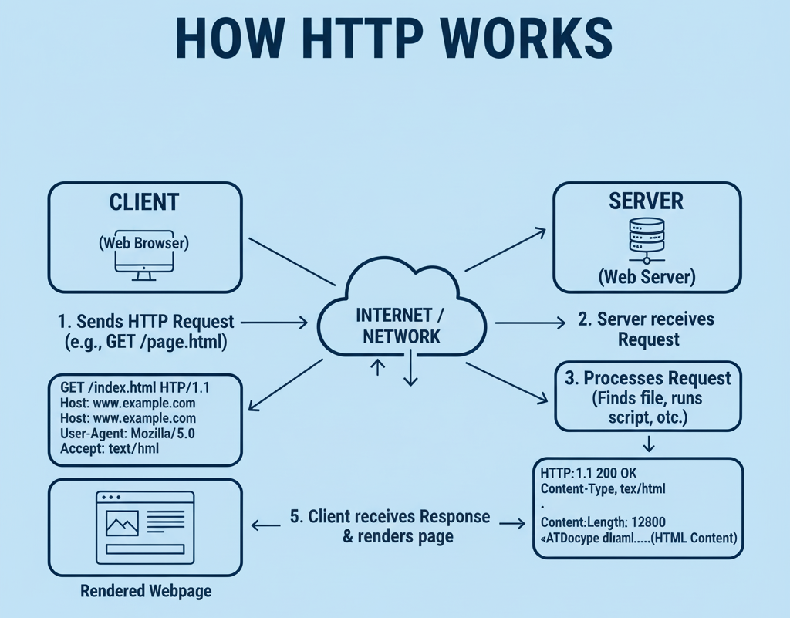

- **Client sends a request** – Your browser (client) asks the server for a page or resource using an HTTP request (like GET /index.html).

- **Server receives the request** – The web server gets your request.

- **Server processes it** – The server finds the file, runs any scripts if needed, and prepares a response.

- **Server sends a response** – The server replies with an HTTP response, including the status (like 200 OK), headers (content type, length), and the actual content (HTML, JSON, etc.).

- **Client receives and renders** – Your browser gets the response and displays the webpage.

- **In short**: HTTP is a request-response system where the client asks, the server responds, and the web page gets displayed.

---

## Part 2: The Core Principles of REST

<a name="part-2-the-core-principles-of-rest"></a>

### Client-Server Architecture

<a name="client-server-architecture"></a>

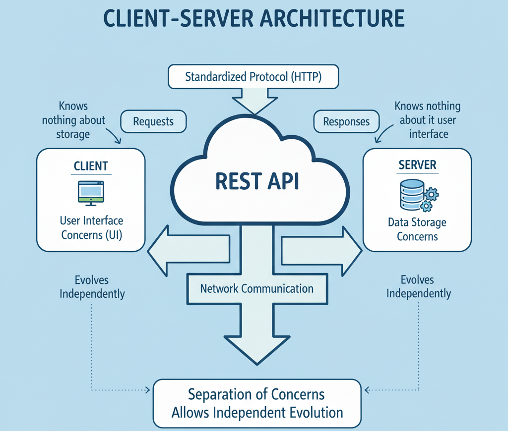

REST separates the user interface concerns (the **client**) from the data storage concerns (the **server**). The client knows nothing about how the data is stored, and the server knows nothing about the user interface. They communicate over a network using a standardized protocol (HTTP). This separation allows them to evolve independently.

### Statelessness

<a name="statelessness"></a>

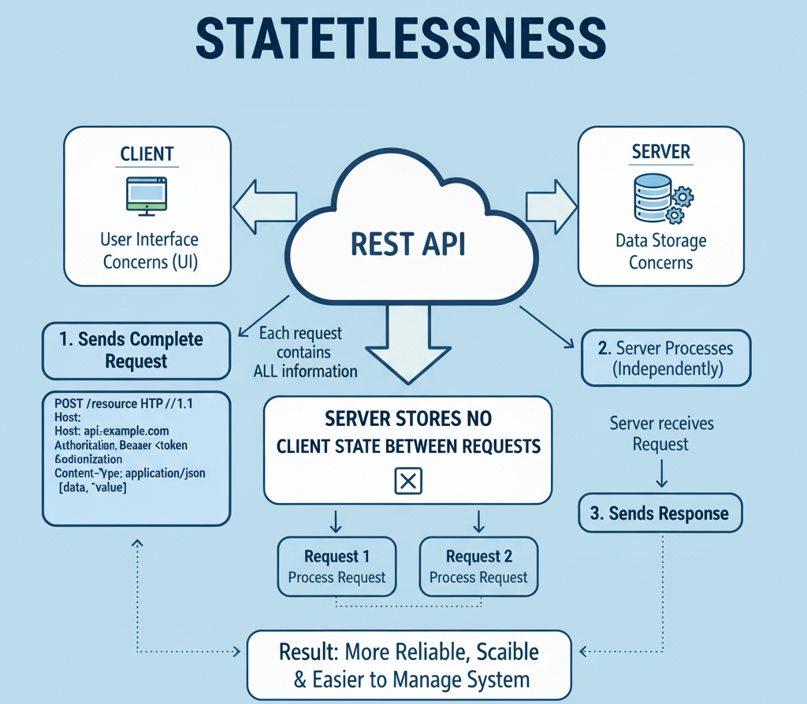

This is a crucial principle. **Each request from a client to the server must contain all the information the server needs to understand and complete the request.** The server does not store any information about the client's state between requests. If a request requires authentication, the client must send authentication credentials with *every single request*. This makes the system more reliable, scalable, and easier to manage.

### Uniform Interface

<a name="uniform-interface"></a>
This is the guiding principle of REST design and simplifies the architecture. It has four main aspects:
1.  **Resource-Based:** Everything is a **resource** (e.g., a user, a virtual machine, a CI/CD pipeline). Resources are identified by **URIs** (Uniform Resource Identifiers), like a URL.

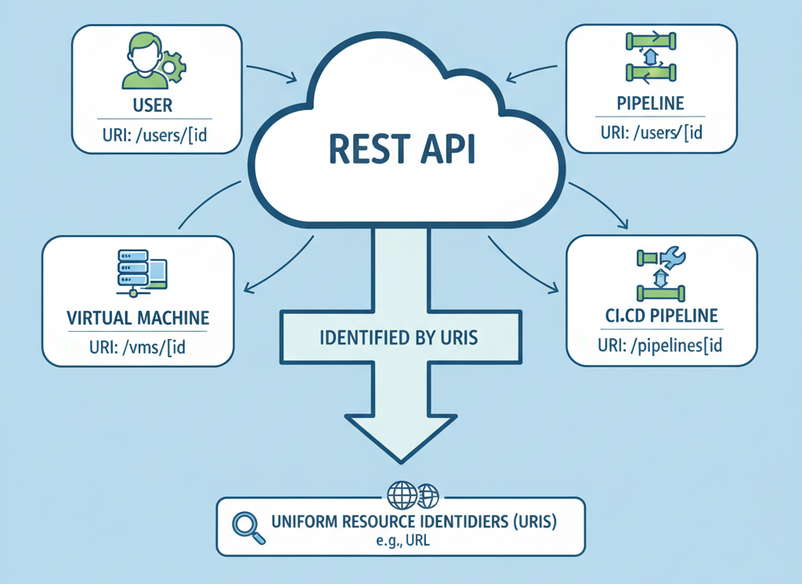

2.  **Manipulation of Resources Through Representations:** The client holds a representation of a resource (e.g., a JSON object). When it wants to modify the resource, it sends this representation to the server with the desired changes.

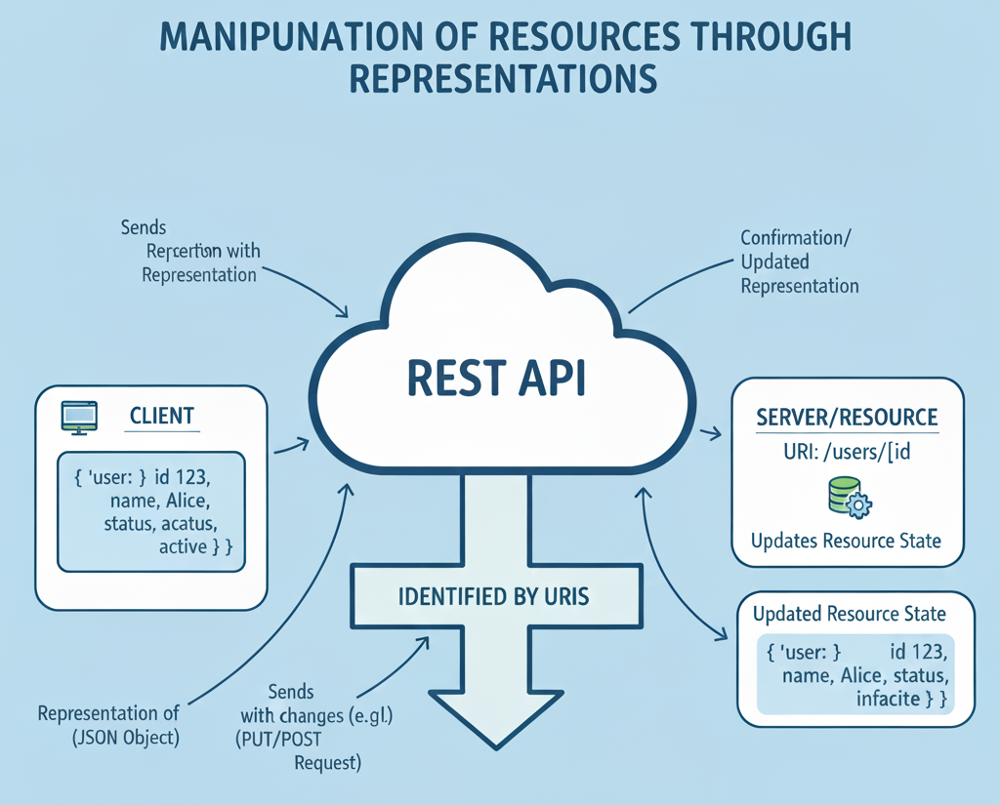

3.  **Self-Descriptive Messages:** Each request and response contains enough information to describe how to process it (e.g., HTTP headers specifying the content type like `application/json`).

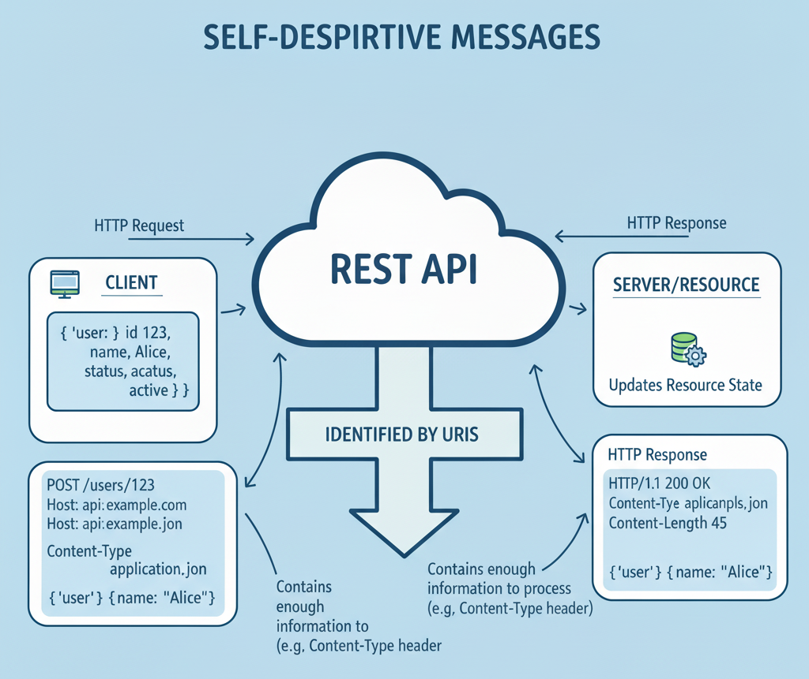

4.  **Hypermedia as the Engine of Application State (HATEOAS):** A mature REST API will include links in its responses that tell the client what other actions they can take next. For example, a response for a user might include a link to view that user's orders.

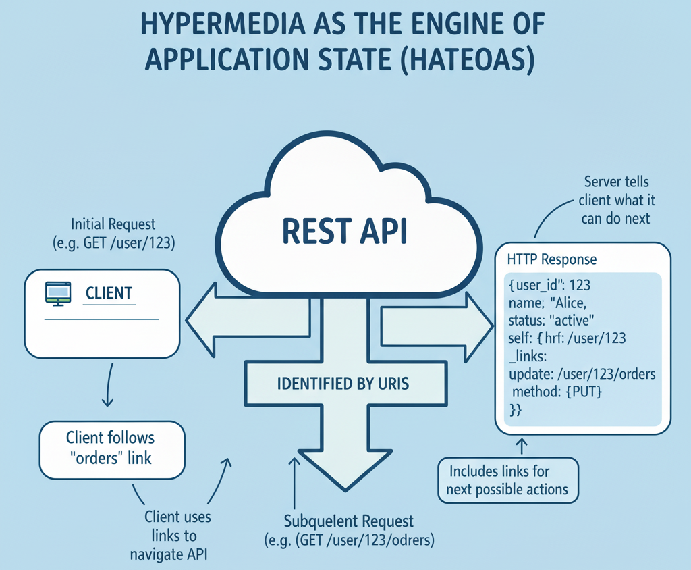

---

## Part 3: Anatomy of an API Interaction

<a name="part-3-anatomy-of-an-api-interaction"></a>
Every REST interaction consists of a request from the client and a response from the server.

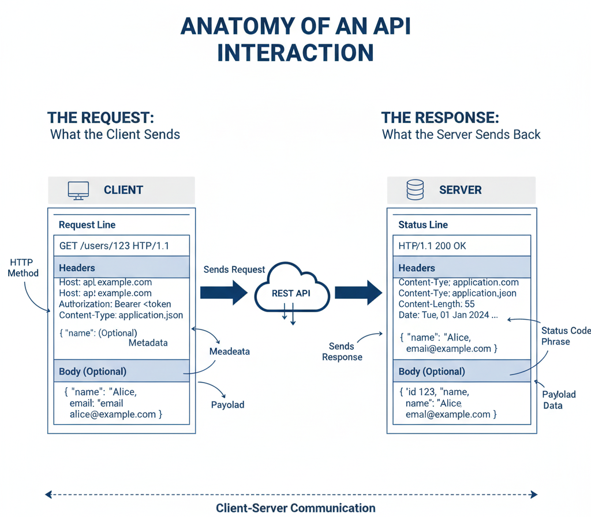

### The Request: What the Client Sends

<a name="the-request-what-the-client-sends"></a>
A request has three main parts:
1.  **Request Line:** Contains the **HTTP Method** (e.g., `GET`), the **URI** (e.g., `/users/123`), and the HTTP version.
2.  **Headers:** Key-value pairs that provide metadata about the request, such as `Host`, `Content-Type`, and `Authorization`.
3.  **Body (Optional):** The actual data (payload) being sent to the server, typically in JSON format. This is used with methods like `POST`, `PUT`, and `PATCH`.

### The Response: What the Server Sends Back

<a name="the-response-what-the-server-sends-back"></a>
A response mirrors the request structure:
1.  **Status Line:** Contains the HTTP version, a **Status Code** (e.g., `200`), and a Reason Phrase (e.g., `OK`).
2.  **Headers:** Key-value pairs providing metadata about the response, like `Content-Type` and `Content-Length`.
3.  **Body (Optional):** The data requested by the client, usually in JSON format.

---

## Part 4: HTTP Methods - The Verbs of REST

<a name="part-4-http-methods-the-verbs-of-rest"></a>
HTTP methods tell the server what action to perform on the resource identified by the URI.

### `GET`: Retrieve a Resource

<a name="get-retrieve-a-resource"></a>

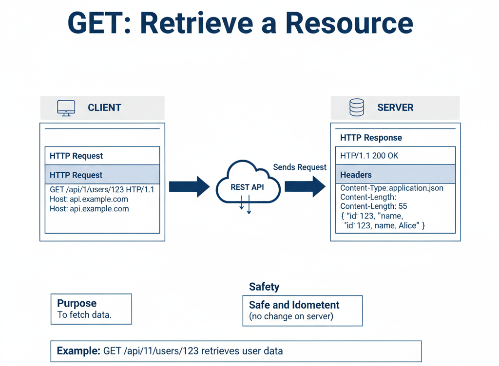

* **Purpose:** To fetch data.
* **Example:** `GET /api/v1/users/123` retrieves the user with ID 123.
* **Safety:** Safe and idempotent (making the same `GET` request multiple times has the same effect as making it once).

### `POST`: Create a New Resource

<a name="post-create-a-new-resource"></a>

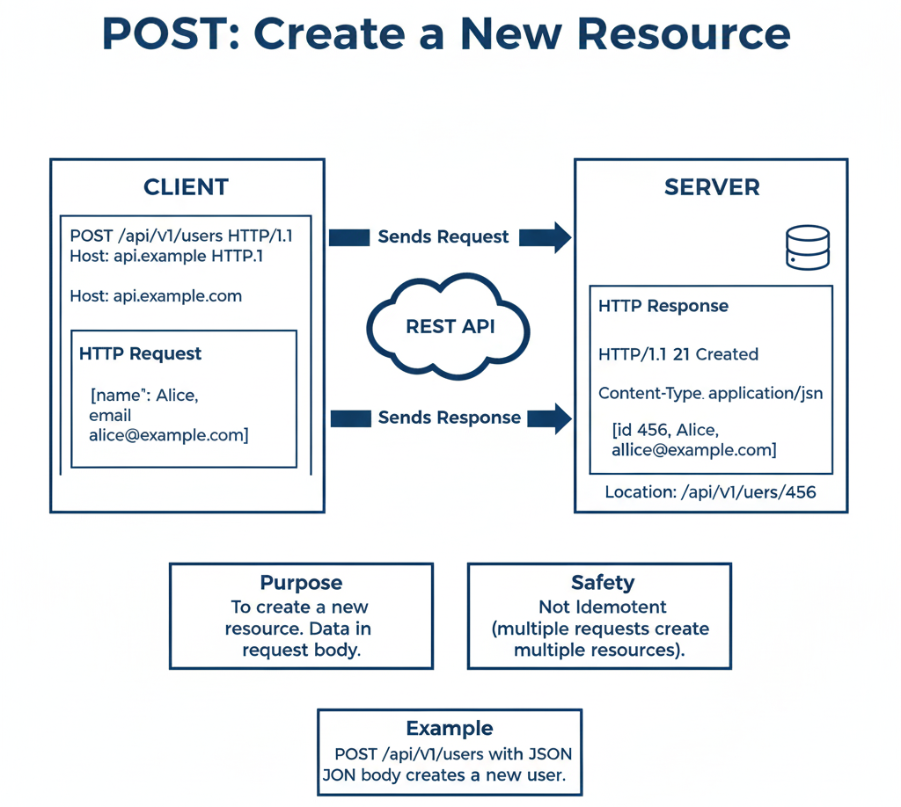

* **Purpose:** To create a new resource. The data for the new resource is in the request body.
* **Example:** `POST /api/v1/users` with a JSON body containing user details creates a new user.
* **Safety:** Not idempotent (making the same `POST` request multiple times will create multiple new resources).

### `PUT`: Replace a Resource

<a name="put-replace-a-resource"></a>

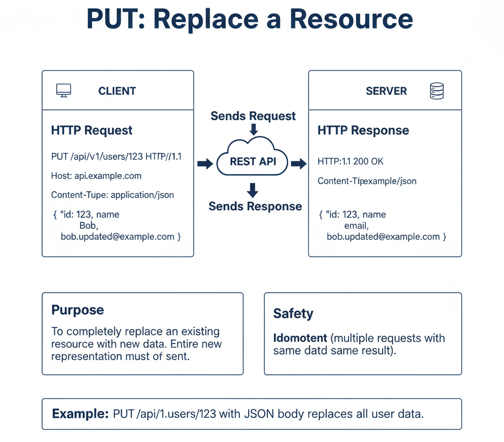

* **Purpose:** To completely replace an existing resource with new data. The entire new representation must be sent in the body.
* **Example:** `PUT /api/v1/users/123` with a JSON body replaces all data for user 123.
* **Safety:** Idempotent (calling it multiple times with the same data yields the same result).

### `PATCH`: Partially Update a Resource

<a name="patch-partially-update-a-resource"></a>

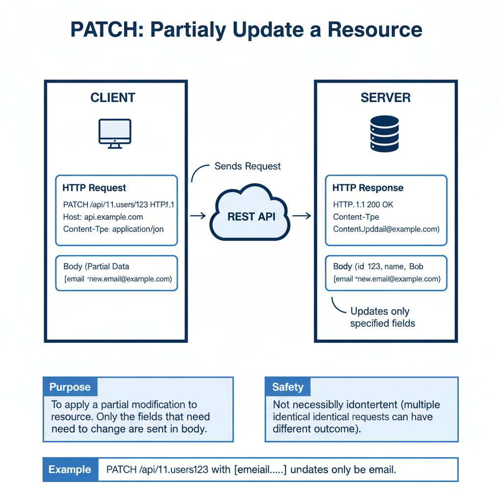

* **Purpose:** To apply a partial modification to a resource. Only the fields that need to change are sent in the body.
* **Example:** `PATCH /api/v1/users/123` with `{"email": "new.email@example.com"}` updates only the email address.
* **Safety:** Not necessarily idempotent.

### `DELETE`: Remove a Resource

<a name="delete-remove-a-resource"></a>

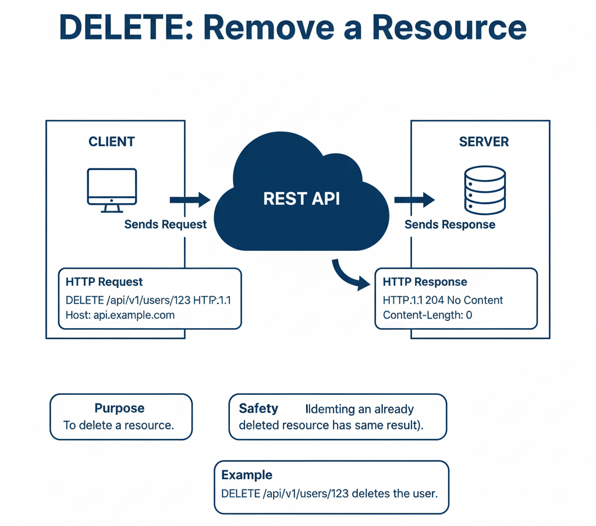

* **Purpose:** To delete a resource.
* **Example:** `DELETE /api/v1/users/123` deletes the user with ID 123.
* **Safety:** Idempotent (deleting something that's already deleted still results in it being deleted).

---

## Part 5: HTTP Status Codes - The API's Feedback

<a name="part-5-http-status-codes-the-apis-feedback"></a>
Status codes are the server's way of telling you whether your request succeeded, failed, or something else happened.

### Understanding Code Categories (2xx, 4xx, 5xx)

<a name="understanding-code-categories-2xx-4xx-5xx"></a>
* **`2xx` - Success:**
    * `200 OK`: Standard success response for `GET`, `PUT`, `PATCH`.
    * `201 Created`: The request was successful, and a new resource was created (`POST`).
    * `204 No Content`: The request was successful, but there is no data to return (`DELETE`).
* **`4xx` - Client Error (You made a mistake):**
    * `400 Bad Request`: The server could not understand the request (e.g., malformed JSON).
    * `401 Unauthorized`: You are not authenticated. You need to provide valid credentials.
    * `403 Forbidden`: You are authenticated, but you do not have permission to access this resource.
    * `404 Not Found`: The requested resource does not exist.
* **`5xx` - Server Error (The server made a mistake):**
    * `500 Internal Server Error`: A generic error indicating something went wrong on the server.
    * `503 Service Unavailable`: The server is temporarily down for maintenance or is overloaded.


---

## Part 6: Authentication and Security

<a name="part-6-authentication-and-security"></a>
Most APIs are protected and require you to prove your identity.

### Basic Authentication

<a name="basic-authentication"></a>
- The client sends a username and password in the `Authorization` header, encoded in Base64. It is simple but not very secure unless used over HTTPS.

### API Keys

<a name="api-keys"></a>
- The client sends a unique key (a long string) that identifies the application. This key can be sent in a custom header (`X-API-Key`) or as a query parameter.

### OAuth 2.0 and Bearer Tokens

<a name="oauth-20-and-bearer-tokens"></a>
- This is the industry standard for secure authorization. The client first obtains a temporary **access token** (often called a Bearer Token or JWT) from an authorization server. It then includes this token in the `Authorization` header for all subsequent API requests.
* **Header Example:** `Authorization: Bearer <your_access_token>`

---

## Part 7: Best Practices in API Design and Usage

<a name="part-7-best-practices-in-api-design-and-usage"></a>

### URI Naming Conventions

<a name="uri-naming-conventions"></a>
* **Use Nouns, Not Verbs:** URIs should identify resources. The HTTP method specifies the action.
    * **Good:** `GET /users`, `DELETE /users/123`
    * **Bad:** `GET /getAllUsers`, `POST /deleteUser/123`
* **Use Plural Nouns:** For collections, use plural nouns (e.g., `/users`, `/deployments`).

### API Versioning

<a name="api-versioning"></a>
APIs evolve. To avoid breaking changes for existing clients, APIs should be versioned. The most common method is to include the version number in the URI path.
* **Example:** `https://api.example.com/v1/users`

### Pagination, Filtering, and Sorting

<a name="pagination-filtering-and-sorting"></a>
For APIs that return large lists of items, it's essential to support:
* **Pagination:** Returning data in chunks or "pages" (e.g., `?page=2&limit=100`).
* **Filtering:** Allowing the client to narrow down results (e.g., `?status=completed`).
* **Sorting:** Allowing the client to order results (e.g., `?sort=-created_at`).

---

## Part 8: Practical DevOps Tooling

<a name="part-8-practical-devops-tooling"></a>

### Using `curl` for Command-Line API Interaction

<a name="using-curl-for-command-line-api-interaction"></a>
`curl` is a powerful command-line tool for making HTTP requests. It's perfect for quick tests and scripting.

**Example: GET request with a header**
```sh
curl -X GET "https://api.github.com/users/torvalds" -H "Accept: application/vnd.github.v3+json"
```

This is a GET request sent to GitHub’s API using curl (a command-line tool).

- `-X GET` → tells curl to use the GET method.
- The URL → `https://api.github.com/users/torvalds` asks for user info of “torvalds”.
- `-H` → adds a header to the request.
- "`Accept: application/vnd.github.v3+json`" → tells GitHub you want the response in JSON format (GitHub API version 3).

**In short**: This command asks GitHub’s API to return details about user torvalds in JSON.

----

**Example: POST request with a JSON body**
```sh
curl -X POST "https://jsonplaceholder.typicode.com/posts" \
-H "Content-Type: application/json" \
-d '{"title": "foo", "body": "bar", "userId": 1}'
```

This is a POST request sent to a test API (jsonplaceholder.typicode.com) using curl (a command-line tool).

- `-X POST` → tells curl to use the POST method. Unlike GET, POST is used to send data to the server.
- The URL → `https://jsonplaceholder.typicode.com/posts` specifies the endpoint where we want to create a new "post".
- `-H "Content-Type: application/json"` → adds a header specifying the type of data being sent. Here, it tells the server that the request body is in JSON format.
- `-d '{"title": "foo", "body": "bar", "userId": 1}'` → the data payload sent with the request. This JSON contains the information for the new post:
    - "title": "foo" → the post’s title
    - "body": "bar" → the post’s content
    - "userId": 1" → the user ID associated with this post

**In short**: This command tells the API to create a new post with the given title, body, and user ID in JSON format. The server will process it and usually return the created post with an ID.

---

### Using Postman for GUI-Based API Exploration

<a name="using-postman-for-gui-based-api-exploration"></a>
- Postman is a graphical application that makes it easy to build, test, and document APIs. It's an excellent tool for exploring a new API before you start writing automation scripts.

---

## Conclusion

<a name="conclusion"></a>
REST is more than just a technical concept; it is the fundamental communication style of the automated, interconnected world of DevOps. By understanding its principles—from client-server architecture and statelessness to the proper use of HTTP methods and status codes—you gain the ability to interface with any modern tool or service. Mastering REST empowers you to write more effective automation, build more resilient systems, and truly practice "Infrastructure as Code."
